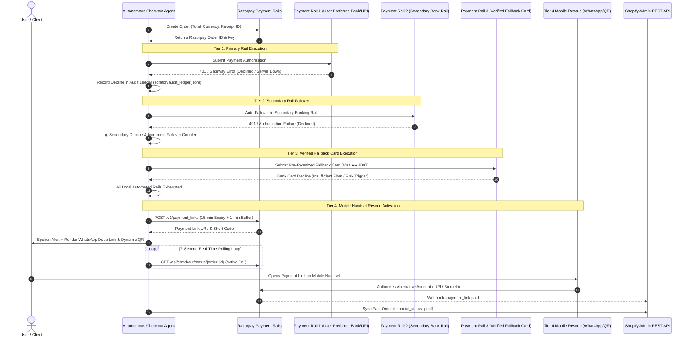
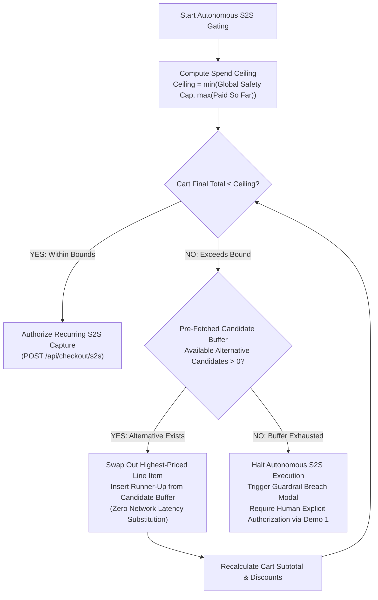
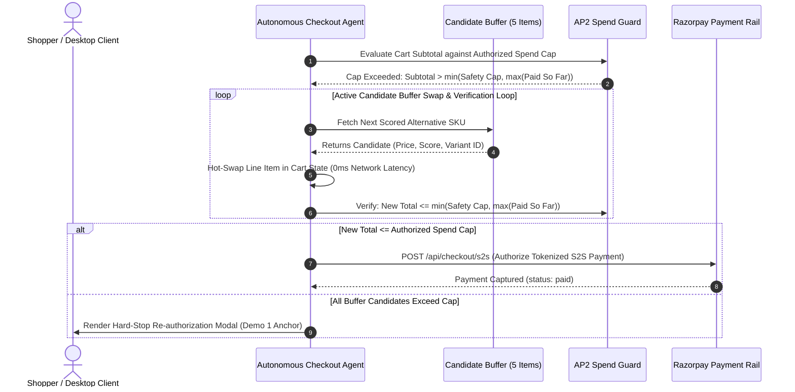
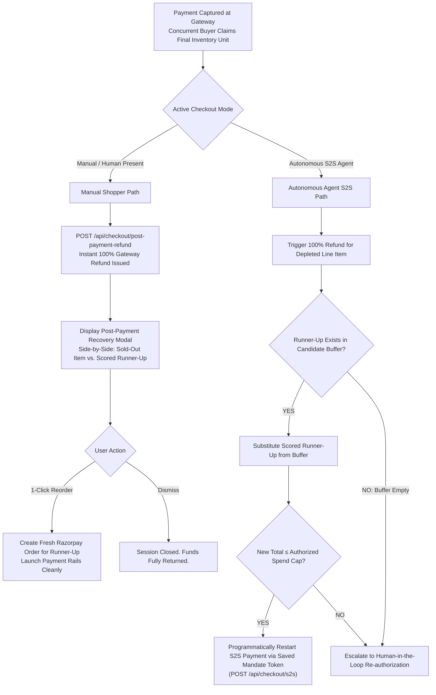
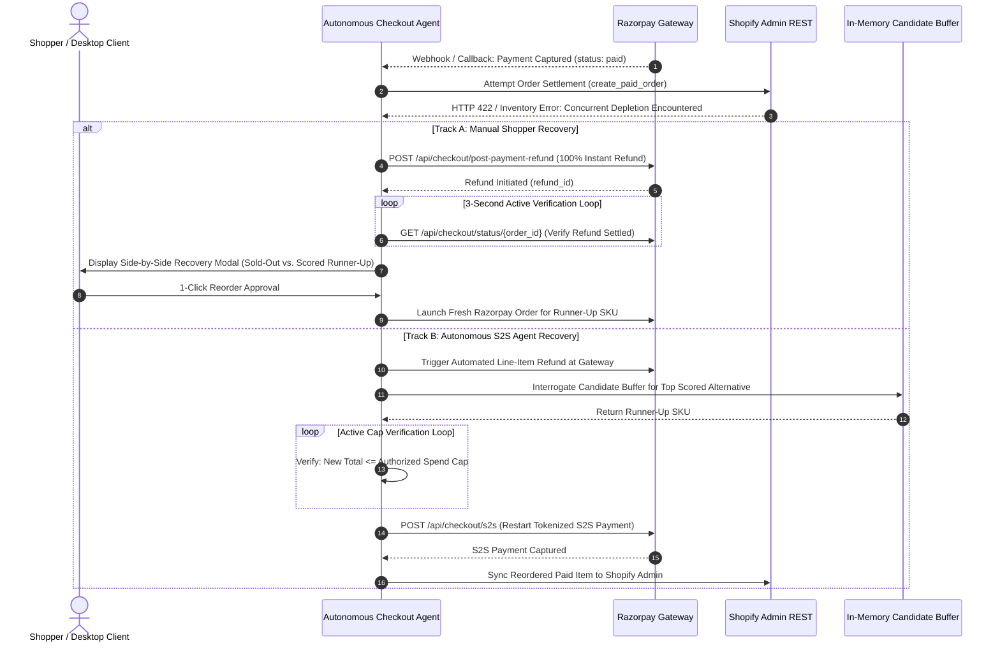
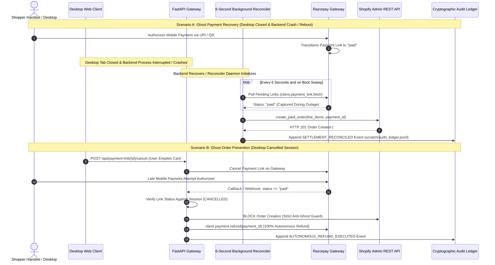

# Rasor: Autonomous Agentic Commerce Engine

[](https://python.org)
[](https://fastapi.tiangolo.com)
[-61DAFB.svg)](https://reactjs.org)
[](docs/API_SPECIFICATION.md)

Rasor is an autonomous agentic commerce platform that connects natural language intent resolution with cryptographically verified, bound transaction execution. Designed for apparel e-commerce, the system incorporates W3C Agent Payment Protocol (**AP2**) spending mandates, machine-readable discovery feeds (**ACP-2026.1**), a deterministic multi-rail banking failover cascade, continuous cylindrical color science (**CIEDE2000 / LCh**), dynamic category budget scaling, and server-side background settlement reconcilers.

---

## 1. Master System Architecture

The following architectural flowchart illustrates the end-to-end data highway from user ingestion to final settlement and background reconciliation, capturing all conditional branches, fallback paths, and state transitions across the platform.

```mermaid
flowchart TD
    subgraph Layer1 ["🌐 Tier 1: Ingestion, Lore Normalization & Intent Routing"]
        direction TB
        VoiceIn["🎙️ Web Speech API Listener<br/>(Real-Time Audio Input)"]
        TextIn["⌨️ Natural Language Prompt<br/>(Conversational Query)"]
        PreProc["🧹 Deterministic Lore Engine<br/>• Spellcheck Dictionary &amp; Synonym Expander<br/>• Character-to-Franchise Mapping Matrix"]
        FastParser["⚡ Deterministic Zero-Token Parser<br/>10-Dimension Regex (Category, Color, Fit, Size, Cap)"]
        MultiLLM{"🤖 Structured Intent Normalizer<br/>Primary: Gemini 3.1 Flash Lite"}
        GroqFallback{"🔄 Secondary LLM Fallback<br/>Groq Llama-3.3-70b-Versatile"}
        RegexFallback["⚡ Deterministic Regex Fallback (parser.py)<br/>Offline Entity &amp; Budget Extraction"]
        MappingSpec["🗺️ Canonical Query Compiler<br/>(CanonicalShoppingQuery &amp; MultiShoppingQuery)"]

        VoiceIn --> PreProc
        TextIn --> PreProc
        PreProc --> FastParser
        FastParser --> MultiLLM
        MultiLLM -->|Success: Structured JSON| MappingSpec
        MultiLLM -->|HTTP 429 / Timeout / Network Error| GroqFallback
        GroqFallback -->|Success: Structured JSON| MappingSpec
        GroqFallback -->|Network / Parse Failure| RegexFallback
        RegexFallback --> MappingSpec
    end

    subgraph Layer2 ["📡 Tier 2: Progressive Retrieval, Multimodal VQA & Styling (Single Items)"]
        direction TB
        Retrieval["📡 5-Tier Progressive Retrieval<br/>Tier 1: Structured Predicates &bull; Tier 2: Storefront Search<br/>Tier 3: Per-Term Union &bull; Tier 4: Product Type Only &bull; Tier 5: Full Catalog"]
        WAF["🛡️ Upstream Window Clamping &amp; Filter<br/>Clamps limit &le; 48 SKUs to avoid HTTP 400<br/>Filters Subclass Category Bleed"]
        DeepPDP["🔬 Deep PDP Metadata Enrichment<br/>Parallel v2 API: Origin PIN, Fabric, Reviews"]
        VQACheck{"VQA Required / Strict Filter Enabled?"}
        VisionEngine["🔬 Parallel Gemini Vision VQA<br/>(ThreadPoolExecutor, 4 Workers, Max 16 Images)"]
        VQAInspect{"Vision Layout Verdict"}
        DropItem["❌ Drop Discarded Candidate<br/>(Invalid Silhouette / Wrong Character)"]
        KeepItem["✅ Retain Scored Candidate"]
        ColorEngine["🎨 Cylindrical LCh &amp; CIEDE2000 Engine<br/>&Delta;E00 &le; 12.0 Perceptual Match &bull; Style Collision Matrix &bull; Monk Skin Tone Boost"]
        LogisticsEngine["🚚 Geodesic Logistics Engine<br/>6 Regional Fulfillment Hubs (Haversine) &bull; Velocity Tiers: Express 24h &rarr; Standard 96h"]

        Retrieval --> WAF
        WAF --> DeepPDP
        DeepPDP --> VQACheck
        VQACheck -->|Yes: Visual Constraints Present| VisionEngine
        VisionEngine --> VQAInspect
        VQAInspect -->|Valid Visual Match| KeepItem
        VQAInspect -->|Invalid Silhouette / Character| DropItem
        VQACheck -->|No: Standard Query| KeepItem
        KeepItem --> ColorEngine
        ColorEngine --> LogisticsEngine
    end

    subgraph Layer3 ["💻 Tier 3: Reactive Outfit Studio & Cart Cryptography (Multi-Piece Bundles)"]
        direction TB
        MultiIntentInput["👗 Multi-Piece Request Ingestion<br/>(e.g., Hoodie + Matching Joggers)"]
        DynBudget["⚖️ Dynamic Category Budget Allocator<br/>Weight Formula: w_outerwear=1.0, w_jeans=0.95, w_joggers=0.80, w_tee=0.50"]
        BudgetFloorCheck{"Budget Above Store Minimum Floor P_min?"}
        LowBudgetGuidance["💡 P_min Proactive Guidance Engine<br/>1. Adjust Budget &bull; 2. Swap Category &bull; 3. Focus on Hero Item"]
        ParallelTier2["📡 Parallel Category Retrieval<br/>(Executes Tier 2 Pipeline for Each Garment Piece)"]
        CartesianPairing["🔄 Cartesian Pairing &amp; Style Collision Filter<br/>Strict Gender Compatibility &bull; Max 3 Curated Combos (Hero, Streetwear, Value)"]
        MandateLock["📜 AP2 Cart Mandate Freezing<br/>Deterministic SHA-256 Hash of Sorted Cart Payload"]

        MultiIntentInput --> DynBudget
        DynBudget --> BudgetFloorCheck
        BudgetFloorCheck -->|Below Store Floor| LowBudgetGuidance
        BudgetFloorCheck -->|Viable Budget| ParallelTier2
        ParallelTier2 --> CartesianPairing
        CartesianPairing --> MandateLock
    end

    subgraph Layer4_5 ["💳 Tier 4 & 5: Autonomous Execution, Settlement & Race Condition Recovery"]
        direction TB
        CheckoutRouter{"💳 Checkout Execution Route"}

        subgraph ManualTrack ["🛍️ Track A: Human-Present Checkout"]
            direction TB
            ManualGateway["🛍️ Razorpay Checkout Modal (/api/checkout/order)<br/>Customer Present via Desktop Browser"]
            MandateVaultUpdate["🔑 Mandate Token Vault Updated<br/>Saves recurring token_id &amp; updates authorized cap"]
            ManualGateway --> MandateVaultUpdate
        end

        subgraph AutoTrack ["🤖 Track B: Autonomous S2S Execution"]
            direction TB
            S2SEndpoint["🤖 Autonomous S2S Execution (/api/checkout/s2s)<br/>Programmatic Tokenized Execution"]
            CapGating{"🛡️ Dual-Constraint Budget Gating<br/>Cart Total &le; min(Safety Cap, max(Paid So Far))?"}
            OOSSwapStart["🔄 Pre-Payment Buffer Swap<br/>Evict 0-qty item &rarr; Insert runner-up from buffer"]
            CapHalt["🛑 Hard Stop Modal<br/>Requires Human Re-authorization in Demo 1"]
            
            MultiRailCascade{"🔄 3-Tier Banking Failover Cascade"}
            RailB1["Rail 1: User Preferred Bank / UPI"]
            RailB2["Rail 2: Secondary Netbanking Rail"]
            RailB3["Rail 3: Verified Fallback Card"]
            MobileRescueLaunch["📱 Tier 4 Mobile Handset Rescue<br/>WhatsApp Link, SMS &amp; Dynamic QR (15m Expiry)"]

            S2SEndpoint --> CapGating
            CapGating -->|Exceeds Cap| OOSSwapStart
            OOSSwapStart -. Re-evaluate with Runner-Up .-> CapGating
            OOSSwapStart -->|All Buffer Candidates Exceed Cap| CapHalt
            CapHalt -. Authorize via Desktop .-> ManualGateway

            CapGating -->|Within Authorized Cap| MultiRailCascade
            MultiRailCascade -->|Attempt 1| RailB1
            RailB1 -->|Declined / Timeout| RailB2
            RailB2 -->|Declined / Timeout| RailB3
            RailB3 -->|All 3 Rails Declined| MobileRescueLaunch
        end

        PaymentJunction{"Payment Verified &amp; Captured?"}
        PostPaymentVerification{"⚡ Post-Payment Inventory Check<br/>Concurrent Depletion Detected?"}
        ShopifySettlement["✅ Shopify Order Settlement<br/>Creates Paid Order via Admin REST API &bull; Logs to scratch/audit_ledger.jsonl"]
        DaemonWorker["⚙️ 6-Second Background Reconciler Daemon<br/>Polls Razorpay &rarr; Syncs to Shopify Independently of Browser State"]
        
        ManualRaceAction["🛡️ Manual Shopper Recovery<br/>100% Instant Gateway Refund &bull; Alternate SKU Modal &bull; 1-Click Reorder"]
        AutoRaceAction["🤖 Autonomous Agent Recovery<br/>Instant Line-Item Refund &bull; Substitute Runner-Up SKU &bull; Restart S2S"]

        CheckoutRouter -->|Human Present| ManualGateway
        CheckoutRouter -->|Autonomous Agent| S2SEndpoint

        MandateVaultUpdate --> PaymentJunction
        RailB1 -->|Captured| PaymentJunction
        RailB2 -->|Captured| PaymentJunction
        RailB3 -->|Captured| PaymentJunction
        MobileRescueLaunch -. User Pays on Phone .-> DaemonWorker

        PaymentJunction -->|Captured| PostPaymentVerification
        PostPaymentVerification -->|In Stock| ShopifySettlement
        PostPaymentVerification -->|Depleted - Manual| ManualRaceAction
        PostPaymentVerification -->|Depleted - Autonomous| AutoRaceAction
        AutoRaceAction -. Programmatically Restarts S2S .-> S2SEndpoint
        ShopifySettlement --> DaemonWorker
    end

    %% Contract Highways
    Layer1 ==>|Single-Item: CanonicalShoppingQuery| Layer2
    Layer1 ==>|Multi-Item: MultiShoppingQuery| Layer3
    Layer2 ==>|Single Item Ranked Candidate| MandateLock
    MandateLock ==>|Frozen Cart SHA-256 Signature| CheckoutRouter

    %% Styling
    style Layer1 fill:none,stroke:#3b82f6,stroke-width:2px
    style Layer2 fill:none,stroke:#10b981,stroke-width:2px
    style Layer3 fill:none,stroke:#06b6d4,stroke-width:2px
    style Layer4_5 fill:none,stroke:#f59e0b,stroke-width:2px
    style ManualTrack fill:none,stroke:#06b6d4,stroke-width:1.5px,stroke-dasharray: 4 4
    style AutoTrack fill:none,stroke:#f59e0b,stroke-width:1.5px,stroke-dasharray: 4 4
```



---

## 2. Core Architectural Mechanisms & Technical Differentiators

### 2.1 Multi-Rail Banking Failover Cascade & Real-Time Polling Verification
In autonomous agentic commerce, bank gateway timeouts, network spikes, and merchant routing declines frequently cause transaction aborts. Rather than returning fatal checkout failures to the shopper, Rasor intercepts payment declines at the gateway level and executes an automated cascade across pre-configured payment rails:

1. **Cascade Topology:**
   - **Payment Rail 1:** User Preferred Netbanking / Primary UPI Handle.
   - **Payment Rail 2:** Secondary Netbanking Rail (inter-bank fallback).
   - **Payment Rail 3:** Pre-tokenized Verified Fallback Card.
   - **Tier 4 Mobile Rescue:** If all local rails decline, the agent automatically generates an out-of-band Razorpay Payment Link (15-minute TTL + 1-minute buffer) and pushes dynamic WhatsApp links, SMS notifications, and an on-screen QR code to allow the user to complete payment on their mobile device via alternate apps or biometrics.
2. **3-Second Active Verification Loop:**
   During transaction processing and mobile rescue states, the client and server maintain a **3-second active polling loop** (`GET /api/checkout/status/{order_id}` and background reconciler). This ensures that payment authorizations are recognized instantaneously upon capture, keeping client and server state synchronized with zero human page refreshes.



---

### 2.2 Dual-Dimension Race Condition Handling & AP2 Autonomous Spend Gating
In autonomous agentic commerce, inventory depletion and budget ceiling breaches occur at two critical lifecycle checkpoints: **In-Cart Pre-Payment** (Dimension 1) and **At Settlement Post-Payment** (Dimension 2). Rasor resolves both dimensions deterministically through in-memory candidate buffer swaps, mathematical AP2 spending caps, and active verification loops.

#### 2.2.1 Dimension 1: Pre-Payment Inventory Depletion & AP2 Spend Gating (In-Cart)
To satisfy the financial safety principles of W3C AP2, autonomous server-to-server payments cannot execute open-ended transactions without deterministic upper bounds. Rasor enforces a dual-constraint mathematical spend ceiling:

$$\text{Autonomous Spend Ceiling} = \min\Big(\text{Global Safety Hard Cap}, \; \max(\text{Historical Authorized Payments})\Big)$$

* **Initial Authorization Anchor (Demo 1):** When a user executes an initial interactive checkout (e.g., ₹800), that amount is permanently recorded in the mandate vault as `max(Paid So Far) = ₹800`.
* **Autonomous Enforcement (Demo 2 & Demo 3):** On subsequent autonomous runs, the agent can only spend up to this historical high-water mark, capped globally by `Global Safety Cap` (e.g., ₹3,000).
* **Pre-Payment Candidate Buffer Swapping:** If an in-cart SKU drops to `quantity = 0` or a proposed cart exceeds the authorized spend cap, the agent does not abort. It inspects the pre-fetched candidate buffer (`DEFAULT_CANDIDATE_BUFFER`), evicts the depleted or highest-priced item, and swaps in a scored runner-up with zero network latency. An active verification loop repeatedly re-checks the mathematical ceiling until a viable cart is approved or buffer candidates are exhausted (triggering a human re-authorization modal).

<div style="display: flex; flex-wrap: wrap; gap: 20px; align-items: flex-start;">
<div style="flex: 1.5; min-width: 320px;">

##### Decision Gating Tree (In-Cart Gating)


</div>
<div style="flex: 3.5; min-width: 480px;">

##### Active Candidate Buffer Swap & Verification Loop


</div>
</div>

---

#### 2.2.2 Dimension 2: Post-Payment Concurrent Collision & Settlement Recovery (At Settlement)
During high-velocity flash sales, a concurrent buyer may purchase the final inventory unit at the merchant store after payment has been captured at Razorpay, but before Shopify order creation completes. Rasor intercepts this collision and executes divergent recovery pathways depending on user presence:

1. **Manual Shopper Pathway:**
   - Initiates an immediate 100% gateway refund (`POST /api/checkout/post-payment-refund`).
   - Runs a **3-second active polling verification loop** to confirm gateway settlement.
   - Renders a side-by-side Post-Payment Recovery Modal comparing the sold-out item against the top scored runner-up with a 1-click reorder trigger.
2. **Autonomous S2S Agent Pathway:**
   - Triggers an automated line-item refund at the gateway.
   - Interrogates the in-memory candidate buffer for the next best viable SKU.
   - Runs an active spend cap verification loop (`New Total ≤ Authorized Spend Cap?`).
   - Re-fires tokenized payment and order settlement programmatically (`POST /api/checkout/s2s`) via saved mandate tokens.

<div style="display: flex; flex-wrap: wrap; gap: 20px; align-items: flex-start;">
<div style="flex: 1.5; min-width: 320px;">

##### Decision Gating Tree (Post-Payment Recovery)


</div>
<div style="flex: 3.5; min-width: 480px;">

##### Active Polling, Refund & S2S Recovery Sequence


</div>
</div>

---

### 2.3 The Dual "Ghost" Dilemma Solutions
In distributed agentic commerce where payments and merchant order management systems operate across disparate networks, state desynchronization can produce two catastrophic failure modes:

* **Ghost Payment (Browser Closed / Backend Crash Recovery):** Shopper triggers Tier 4 Mobile Rescue and authorizes payment on their phone. Because the reconciler runs as an autonomous server-side daemon, user actions like closing the browser tab, minimizing windows, or laptop sleep have zero effect on fulfillment. However, if a severe infrastructure fault occurs—such as a **backend server process crash, container restart, or network partition** while mobile payment is in-flight—the client-side polling session is destroyed. Rasor's reconciler daemon resolves this through deterministic boot-time catch-up: upon server recovery/restart, the daemon immediately audits active payment links with Razorpay, detects transactions captured during the outage, creates the corresponding paid order in Shopify Admin REST API, and logs the reconciliation event to `scratch/audit_ledger.jsonl`.
* **Ghost Order (Desktop Cancelled while Mobile Redirect Open):** Shopper opens mobile payment redirect, but clicks "Cancel" or "Empty Cart" on desktop. If they complete OTP on mobile moments later, the system must prevent fulfilling a cancelled session.

Rasor solves both dilemmas through an authoritative server-side background reconciler and zero-trust refund engine:



---

### 2.4 Cylindrical LCh & CIEDE2000 Color Engine
Rather than relying on subjective LLM color adjectives, the system converts hexadecimal colors into CIELAB and cylindrical LCh coordinates:

$$\Delta E_{00} = \sqrt{\left(\frac{\Delta L'}{k_L S_L}\right)^2 + \left(\frac{\Delta C'}{k_C S_C}\right)^2 + \left(\frac{\Delta H'}{k_H S_H}\right)^2 + R_T \left(\frac{\Delta C'}{k_C S_C}\right) \left(\frac{\Delta H'}{k_H S_H}\right)} \le 12.0$$

* Continuous hue angle differential ($\Delta h^\circ = |h_1 - h_2|$) validates complementary ($\approx 180^\circ$), analogous ($\le 35^\circ$), and monochromatic ($\le 15^\circ$) pairings.
* A deterministic **Style Collision Matrix** (`BANNED_STYLE_COLLISIONS`) programmatically blocks conflicting aesthetics (e.g., Heavy Graphic Print Top + Camouflage Pattern Bottom).
* **Monk Skin Tone (MST 1–10)** profile weighting applies a $+0.05$ to $+0.15$ harmonic boost for palette compatibility with user undertones.

---

### 2.5 Dynamic Category-Weighted Budget Allocation
To prevent high-cost outerwear from exhausting multi-item bundle budgets, the coordinator distributes funds according to historical category market weights:

$$w_{\text{jacket}} = 1.00, \quad w_{\text{hoodie}} = 1.00, \quad w_{\text{jeans}} = 0.95, \quad w_{\text{joggers}} = 0.80, \quad w_{\text{shirt}} = 0.65, \quad w_{\text{t-shirt}} = 0.50$$

$$\text{Allocated Budget}_i = \text{Total Budget} \times \frac{w_i}{\sum_{j=1}^{N} w_j}$$

If the store minimum price $P_{\min}$ across requested categories exceeds the total budget, the system triggers proactive 3-path stylist guidance:
1. Increase total budget to the exact store minimum requirement.
2. Downgrade heavy categories (e.g., Hoodie $\rightarrow$ T-Shirt).
3. Switch focus to a single hero garment.

---

### 2.6 3-Tier Sticky Sizing Engine
To prevent size drift across multi-turn conversational interactions, sizing resolution follows a deterministic hierarchy:
1. **Explicit Query Token:** Direct mentions in user input (e.g., `"in XL"`, `"size 32"`).
2. **User Profile Default:** Persistent setting stored in user preferences (`defaultSize: "XL"`).
3. **In-Stock Catalog Variant:** First available variant GID from the merchant's live inventory.

---

### 2.7 Machine-Readable Discovery Protocol (ACP-2026.1)
The application exposes public machine-readable discovery manifests conforming to the Agentic Commerce Protocol:
* `GET /.well-known/agentic-commerce.json`: Merchant identity, system of record declaration, supported mandate standards (`AP2`, `UAP`), and API endpoint registries.
* `GET /api/v1/acp/catalog.json`: Machine-consumable inventory feed with structured variant GIDs, dimensions, and stock status for autonomous AI crawler consumption.

---

## 3. Documentation Index

Detailed technical specifications are maintained in the [`docs/`](docs/) and [`docs2/`](docs2/) directories:

| Document | Technical Scope |
| :--- | :--- |
| [**System Architecture Blueprint**](docs/ARCHITECTURE.md) | In-depth specification of reasoning pipelines, mathematical models, data contracts, and component state machines. |
| [**API Specification & Protocols**](docs/API_SPECIFICATION.md) | Comprehensive REST route documentation, ACP-2026.1 protocol contracts, and AP2 JSON schemas. |
| [**Engineering Challenges & Post-Mortem**](docs/CHALLENGES_AND_POSTMORTEM.md) | Technical analysis of upstream WAF mitigations, closed-loop checkout roadblocks, receipt length bounds, and storage pruning. |
| [**Technical Advantages & Evaluation Guide**](docs/PRESENTATION_AND_SECRET_WEAPONS.md) | Architectural benchmark comparisons against standard conversational bots and traditional checkout systems. |
| [**Outfit Studio & Bundle Coordinator Reference**](docs2/sub_docs/OUTFIT_STUDIO_AND_BUNDLE_COORDINATOR.md) | Mathematical budget allocation, Cartesian outfit pairing, and 3-combo synthesis specification. |
| [**Internal Presentation Cheatsheet**](docs2/INTERNAL_PRESENTATION_CHEATSHEET.md) | Evaluator defense scripts, live demo cues, technical Q&A, and emergency curl diagnostics. |
| [**Future Prospects & Research Backlog**](docs/FUTURE_PROSPECTS_AND_RESEARCH.md) | Roadmap for offline CIELAB K-Means clustering, GBDT ranking models, and hardware security module (HSM) AP2 signing. |

---

## 4. Quickstart & Installation

### 4.1 Environment Prerequisites
* Python 3.11+
* Node.js 18+ and npm
* Razorpay Test Mode Credentials
* Google Gemini API Key (Primary) and Groq API Key (Fallback)
* Shopify Storefront & Admin Access Tokens

### 4.2 Setup & Configuration
Clone repository and initialize environment:
```sh
git clone https://github.com/vipulSP2108/Rasor.git
cd Rasor
cp .env.example .env
```

Configure `.env` with your service keys:
```ini
# Payment Rails (Razorpay Test Mode)
TEST_API_KEY=rzp_test_...
TEST_KEY_SECRET=...

# Inference Models
GEMINI_API_KEY=...
GROQ_API_KEY=...

# Headless Storefront & Settlement APIs (Shopify)
SHOPIFY_DOMAIN=rasor-test-store-1.myshopify.com
SHOPIFY_STOREFRONT_TOKEN=...
SHOPIFY_ADMIN_TOKEN=shpat_...

# Real-Time PDP Enrichment Endpoints (Bewakoof)
BEWAKOOF_API_TOKEN=your_upstream_api_token
BEWAKOOF_CLIENT_DEVICE_TOKEN=...
```

### 4.3 Automated Startup
Launch both the FastAPI backend and React frontend with a single command:
```sh
chmod +x start.sh
./start.sh
```

Service endpoints:
* React UI: `http://localhost:5173`
* FastAPI Backend: `http://localhost:8000`
* OpenAPI Documentation: `http://localhost:8000/docs`

---

## 5. Catalog Provenance & Architectural Evolution

### Academic & Educational Intent Disclaimer
We explicitly acknowledge **Bewakoof.com** for their catalog taxonomies, merchandising structures, and product design assets.

> [!NOTE]
> **Educational & Learning Disclaimer:** This project was developed strictly as an academic research prototype for the Razorpay Agentic Commerce Hackathon. The platform has no formal commercial affiliation with or endorsement from Bewakoof.com. All catalog structures and metadata endpoints were evaluated solely for non-commercial educational benchmarking under fair use.

### Evolution from Overlay to Headless Shopify Settlement
1. **Initial Exploration:** The system was originally prototyped as an agentic overlay interacting directly with merchant mobile endpoints (`/v1/collections/...` and `/v2/product/{pid}`).
2. **Checkout Roadblock:** While discovery endpoints provided detailed product metadata, Bewakoof's native cart and checkout flows are session-locked and closed-loop, lacking open APIs for programmatic third-party AP2 settlement.
3. **Hybrid Architecture Resolution:**
   - Catalog data was imported into a dedicated Shopify instance via `shopify_import.csv` to provide headless GraphQL cart mutations and Admin REST order creation (`financial_status: paid`).
   - Live Bewakoof mobile endpoints are retained in a hybrid pipeline to dynamically enrich products with manufacturer specs, wash care instructions, live customer ratings, and warehouse origin PIN codes used by the geodesic logistics engine.

---

Developed for the Razorpay Agentic Commerce Hackathon 2026.
