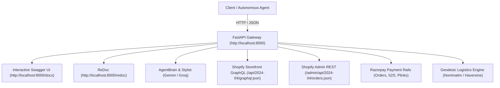

# Rasor: Application Gateway & Protocol API Specification

[](http://localhost:8000/docs)
[](http://localhost:8000/scalar)
[](http://localhost:8000/redoc)
[](shopify_storefront_api_reference.md)
[](shopify_investigation.md)

This document provides an exhaustive, production-tested technical specification for the **FastAPI Gateway (`api/main.py`)**, the **Agentic Commerce Protocol (ACP-2026.1) Discovery Feed**, and the **W3C AP2 Mandate Contracts**.

> [!TIP]
> **Interactive Swagger UI & Live Testing:**
> Once the stack is running via `./start.sh` (or `uvicorn api.main:app --port 8000`), navigate directly to:
> * **Swagger Interactive Explorer:** [`http://localhost:8000/docs`](http://localhost:8000/docs) — execute live curl/REST requests, inspect Pydantic schemas, and test responses directly in your browser with custom dark theme, live beacon, and tag filter.
> * **Scalar Modern Docs:** [`http://localhost:8000/scalar`](http://localhost:8000/scalar) — ultra-slick modern documentation interface with multi-language code snippets.
> * **ReDoc Specification:** [`http://localhost:8000/redoc`](http://localhost:8000/redoc) — clean, formatted OpenAPI reference.
> * **Shopify GraphQL Console:** [`http://localhost:8000/shopify-console`](http://localhost:8000/shopify-console) — embedded GraphiQL playground pre-configured for the Shopify Storefront API (2024-04), with 8 curated example operations and direct variable editing.
>
> All sample requests and responses documented below were hit-tested and captured live against the running backend and live Shopify store (`rasor-test-store-1.myshopify.com`). To prevent empty fields, real data structures are recorded, with long repetitive candidate arrays cleanly truncated using `... /* N additional items */`.


---

## Table of Contents
1. [Interactive API Explorer & Gateway Topology](#1-interactive-api-explorer--gateway-topology)
2. [REST Endpoints Reference (All 35 Verified Routes)](#2-rest-endpoints-reference-all-35-verified-routes)
   - [A. System Health & Gateway Discovery](#a-system-health--gateway-discovery)
   - [B. Search, Catalog & Discovery](#b-search-catalog--discovery)
   - [C. Conversational Stylist & Dialogue State](#c-conversational-stylist--dialogue-state)
   - [D. Aesthetic Basketing, Outfits & Multimodal Extraction](#d-aesthetic-basketing-outfits--multimodal-extraction)
   - [E. Multi-Product Comparison & Logistics Routing](#e-multi-product-comparison--logistics-routing)
   - [F. Headless Cart & Storefront Mutation](#f-headless-cart--storefront-mutation)
   - [G. Payment Rails, S2S Mandates & Mobile Handset Rescue](#g-payment-rails-s2s-mandates--mobile-handset-rescue)
   - [H. Post-Payment Inventory Collisions & Instant Refunds](#h-post-payment-inventory-collisions--instant-refunds)
   - [I. Settlement, Background Reconciler & Audit Ledger](#i-settlement-background-reconciler--audit-ledger)
3. [Agentic Commerce Protocol (ACP-2026.1) Specification](#3-agentic-commerce-protocol-acp-20261-specification)
4. [W3C AP2 Mandate Contracts & Schemas](#4-w3c-ap2-mandate-contracts--schemas)
5. [Gateway-to-Storefront Cross-Reference Mapping](#5-gateway-to-storefront-cross-reference-mapping)

---

## 1. Interactive API Explorer & Gateway Topology

The Rasor API acts as an intelligent orchestration gateway sitting between client interfaces (React UI, voice listeners, autonomous agents) and underlying headless commerce infrastructure (Shopify Storefront GraphQL, Shopify Admin REST, Razorpay payment rails, Gemini Vision multimodal models, and geodesic logistics providers).



---

## 2. REST Endpoints Reference (All 42 Verified Routes)

Base URL: `http://localhost:8000`

### A. System Health & Gateway Discovery

#### `GET /health`
Verifies backend liveness and availability of the `CheckoutAgent`.
* **Response (200 OK):**
  ```json
  {
    "status": "ok",
    "checkout_available": true
  }
  ```

#### `GET /api/razorpay-key`
Provides public Razorpay publishable Key ID for client-side modal initialization.
* **Response (200 OK):**
  ```json
  {
    "key_id": "rzp_test_TXm5XH4dRWrSD9"
  }
  ```

---

### B. Quick Search, Catalog & Discovery

#### `POST /api/quick-search`
Dedicated one-shot natural language Quick Search pipeline. Takes user shopping intent with price caps and velocity preferences, performing instant 5-tier catalog discovery and autonomous buy action detection.
* **Request Body (`QuickSearchRequest`):**
  ```json
  {
    "query": "Show me men's t-shirts with a graphic over it white"
  }
  ```
* **Response (200 OK):** Same payload structure as `POST /api/search`.

#### `POST /api/search`
Orchestrates natural language intent parsing, 5-tier progressive catalog retrieval, attribute filtering, Bayesian pre-sorting, deep PDP v2 enrichment, parallel Gemini Vision VQA verification, and geodesic logistics velocity re-ranking.
* **Request Body (`SearchRequest`):**
  ```json
  {
    "query": "Show me men's t-shirts with a graphic over it white"
  }
  ```

* **Response (200 OK):**
  ```json
  {
    "products": [
      {
        "id": "SHPF-10219274043632",
        "title": "Men's  Black Iron Man Of War Graphic Printed T-shirt",
        "price": 549.0,
        "rating": 4.8,
        "review_count": 809,
        "shipping_days": 3,
        "shipping_speed": "Standard",
        "source_url": "https://rasor-test-store-1.myshopify.com/products/mens-black-iron-man-of-war-graphic-printed-t-shirt",
        "mrp": 1099.0,
        "merchant": "Rasor Test Store 1",
        "specs": {
          "gender": "Men",
          "color": "Black",
          "design": "Graphic Print",
          "fit": "Regular Fit",
          "fabric": "Cotton",
          "neck": "Round Neck",
          "sleeve": "Half Sleeve",
          "subclass": "T-Shirt",
          "fandom_partner": "Marvel",
          "bundle_offers": [],
          "mrp_inr": 1099.0,
          "member_price_inr": null,
          "available_sizes": ["S", "M", "XL", "2XL", "3XL"],
          "image_url": "https://cdn.shopify.com/s/files/1/0859/0304/8944/files/men-s-black-iron-man-of-war-graphic-printed-t-shirt-220650-1753176800-1.jpg?v=1787616135",
          "all_images": [
            "https://cdn.shopify.com/s/files/1/0859/0304/8944/files/men-s-black-iron-man-of-war-graphic-printed-t-shirt-220650-1753176800-1.jpg?v=1787616135"
          ],
          "discount_offer": null,
          "shopify_gid": "gid://shopify/Product/10219274043632",
          "variant_ids": {
            "S": "gid://shopify/ProductVariant/50302872092912",
            "M": "gid://shopify/ProductVariant/50302872125680",
            "L": "gid://shopify/ProductVariant/50302872158448",
            "XL": "gid://shopify/ProductVariant/50302872191216",
            "2XL": "gid://shopify/ProductVariant/50302872223984",
            "3XL": "gid://shopify/ProductVariant/50302872256752"
          },
          "bewakoof_id": "220650"
        },
        "relevance_score": 0.81,
        "verdict": "STRONG_MATCH",
        "is_fast_shipping_requested": false
      }
      /* ... 9 additional curated product objects returned in live search ... */
    ],
    "discarded_products": [
      {
        "id": "SHPF-10219279450352",
        "title": "Men's White Vengeance Graphic Printed Oversized T-shirt",
        "price": 599.0,
        "rating": 4.1,
        "review_count": 412,
        "shipping_days": 3,
        "shipping_speed": "Standard",
        "source_url": "https://rasor-test-store-1.myshopify.com/products/mens-white-vengeance-graphic-printed-oversized-t-shirt",
        "mrp": 1299.0,
        "merchant": "Rasor Test Store 1",
        "specs": {
          "gender": "Men",
          "color": "White",
          "design": "Graphic Print",
          "fit": "Oversized Fit",
          "fabric": "Cotton",
          "neck": "Round Neck",
          "sleeve": "Half Sleeve",
          "subclass": "T-Shirt",
          "fandom_partner": null,
          "bundle_offers": [],
          "mrp_inr": 1299.0,
          "member_price_inr": null,
          "available_sizes": ["S", "M", "L", "XL", "2XL"],
          "image_url": "https://cdn.shopify.com/s/files/1/0859/0304/8944/files/men-s-white-vengeance-graphic-printed-oversized-t-shirt.jpg",
          "all_images": [
            "https://cdn.shopify.com/s/files/1/0859/0304/8944/files/men-s-white-vengeance-graphic-printed-oversized-t-shirt.jpg"
          ],
          "discount_offer": null,
          "shopify_gid": "gid://shopify/Product/10219279450352",
          "variant_ids": {
            "S": "gid://shopify/ProductVariant/50302874123456",
            "M": "gid://shopify/ProductVariant/50302874156224",
            "L": "gid://shopify/ProductVariant/50302874188992",
            "XL": "gid://shopify/ProductVariant/50302874221760"
          },
          "bewakoof_id": "589312"
        },
        "relevance_score": 0.79,
        "verdict": "PARTIAL_MATCH",
        "is_fast_shipping_requested": false
      }
      /* ... 29 additional discarded product objects evaluated and filtered out ... */
    ],
    "evaluations": [
      {
        "product_id": "SHPF-10219296424176",
        "product_title": "Men's Black Batman Graphic Printed T-shirt",
        "is_relevant": true,
        "match_score": 0.79,
        "reason": "The shirt features a clear Batman logo graphic on the chest."
      }
      /* ... 39 additional LLM/VQA candidate evaluations ... */
    ],
    "status": "Found 10 relevant products",
    "canonical_query": {
      "original_prompt": "Show me men's t-shirts with a graphic over it white",
      "cleaned_keywords": "men's white graphic t-shirt",
      "gender": "men",
      "category": "t-shirt",
      "color": "White",
      "design": "Graphic Print",
      "fit": "Any",
      "sleeve": "Any",
      "fabric": "Any",
      "neck": "Any",
      "occasion": "Any",
      "fandom": "None",
      "specific_visual_intent": null,
      "fast_shipping_requested": false,
      "size": null,
      "quantity": 1,
      "max_price": null,
      "min_rating": null,
      "negative_keywords": []
    },
    "sort_mode": "relevance",
    "is_delivery_sorted": false,
    "vqa_ran": true,
    "buy_action": null,
    "bundle_data": null
  }
  ```

#### `POST /api/products/by-ids`
Fetches exact product instances across Storefront GraphQL and fallback providers by ID.
* **Request Body (`ProductsByIdsRequest`):**
  ```json
  {
    "ids": ["SHPF-10219274043632", "SHPF-10219273847024"],
    "data_source": "shopify_storefront_live_api"
  }
  ```
* **Response (200 OK):**
  ```json
  {
    "products": [
      {
        "id": "SHPF-10219274043632",
        "title": "Men's  Black Iron Man Of War Graphic Printed T-shirt",
        "brand": "Generic",
        "merchant": "Rasor Test Store 1",
        "price": 549.0,
        "currency": "USD",
        "rating": 4.8,
        "review_count": 809,
        "in_stock": true,
        "category": "T-Shirt",
        "shipping_days": 3,
        "source_url": "https://rasor-test-store-1.myshopify.com/products/mens-black-iron-man-of-war-graphic-printed-t-shirt",
        "image_url": "https://cdn.shopify.com/s/files/1/0859/0304/8944/files/men-s-black-iron-man-of-war-graphic-printed-t-shirt-220650-1753176800-1.jpg?v=1787616135",
        "specs": {
          "gender": "Men",
          "color": "Black",
          "design": "Graphic Print",
          "fit": "Regular Fit",
          "fabric": "Cotton",
          "neck": "Round Neck",
          "sleeve": "Half Sleeve",
          "fandom_partner": "Marvel",
          "shopify_gid": "gid://shopify/Product/10219274043632",
          "variant_ids": {
            "XL": "gid://shopify/ProductVariant/50302872191216"
          }
        }
      }
      /* ... 1 additional product object ... */
    ],
    "count": 2
  }
  ```

#### `POST /api/offers/evaluate`
Evaluates cart contents against active promotional discounts, bulk tiered deals ("Buy 3 for 1199"), and spend threshold incentives.
* **Request Body (`OfferRequest`):**
  ```json
  {
    "cart_items": {
      "SHPF-10219274043632": 2,
      "SHPF-10219273847024": 1
    },
    "product_lookup": {
      "SHPF-10219274043632": {
        "title": "Men's Black Iron Man Graphic Printed T-shirt",
        "price": 549.0,
        "category": "t-shirt",
        "specs": {"description": "Buy 3 for 1199 special promotional offer"}
      },
      "SHPF-10219273847024": {
        "title": "Men's Black The Other Side Graphic Printed T-shirt",
        "price": 499.0,
        "category": "t-shirt",
        "specs": {"description": "Buy 3 for 1199 special promotional offer"}
      }
    },
    "currency": "INR"
  }
  ```
* **Response (200 OK):**
  ```json
  {
    "status": "success",
    "evaluations": [
      {
        "title": "Buy 3 for 1199",
        "description": "Buy any 3 eligible t-shirts for ₹1,199",
        "is_unlocked": true,
        "estimated_savings": 398.0,
        "quantity_away": 0,
        "message": "🎉 Buy 3 for 1199 Unlocked! You saved ₹398."
      }
    ]
  }
  ```

---

### C. Conversational Stylist & Dialogue State

#### `POST /api/chat`
Advances multi-turn stylist dialogue while preserving question coupling ("one question per message"), occasion analysis, skin tone palette injection, and conversational purchase triggers.
* **Request Body (`ChatRequest`):**
  ```json
  {
    "message": "Show me men's t-shirts with a graphic over it in white color"
  }
  ```
* **Response (200 OK - `ChatResponse`):**
  ```json
  {
    "intent": "clarify",
    "message": "I'd love to help you find a white graphic tee! What is the occasion or vibe you're looking for, and do you have a specific graphic or theme in mind?",
    "suggested_options": [
      "Casual / Streetwear",
      "Gym / Workout",
      "Minimalist Graphic",
      "Pop Culture / Fandom"
    ],
    "ready_for_search": false,
    "updated_query": "",
    "buy_action": null
  }
  ```

#### `POST /api/chat/one-shot`
Direct one-shot delegated purchase execution without back-and-forth clarification turns. Executes the complete 5-tier search and evaluation pipeline under the hood, extracting the canonical query attributes, scoring candidates, resolving buy targets, and preparing items for multi-rail checkout dispatch.
* **Request Body (`OneShotStylistRequest`):**
  ```json
  {
    "prompt": "Show me men's t-shirts with a graphic over it white"
  }
  ```
* **Response (200 OK - `OneShotStylistResponse`):**
  ```json
  {
    "intent": "buy",
    "message": "I can definitely help you find a white graphic t-shirt! Identified top matching apparel items and initiated autonomous multi-rail checkout dispatch.",
    "ready_for_search": true,
    "updated_query": "Show me men's t-shirts with a graphic over it in white color",
    "buy_action": {
      "action": "buy_items",
      "targets": [
        1
      ],
      "quantities": [
        1
      ]
    },
    "selected_items": [
      {
        "product_id": "SHPF-10219276992752",
        "title": "Men's White Better & Better Graphic Printed Oversized T-shirt",
        "price": 699.0,
        "quantity": 1,
        "merchant": "Rasor Test Store 1",
        "image_url": "https://cdn.shopify.com/s/files/1/0859/0304/8944/files/629620_2026-06-02t13-09-19_1.jpg?v=1787616201",
        "specs": {
          "gender": "Men",
          "color": "White",
          "design": "Graphic Print",
          "fit": "Oversized Fit",
          "fabric": "Cotton",
          "neck": "Round Neck",
          "sleeve": "Half Sleeve",
          "subclass": "T-Shirt",
          "mrp_inr": 1299.0,
          "shopify_gid": "gid://shopify/Product/10219276992752"
        }
      }
    ],
    "total_price": 699.0,
    "suggested_options": [
      "Oversized Fit",
      "Regular Fit",
      "Marvel Graphic",
      "Minimalist Graphic"
    ],
    "canonical_query": {
      "original_prompt": "Show me men's t-shirts with a graphic over it white",
      "cleaned_keywords": "men's white graphic t-shirt",
      "gender": "men",
      "category": "t-shirt",
      "color": "White",
      "design": "Graphic Print",
      "fit": "Any",
      "sleeve": "Any",
      "fabric": "Any",
      "neck": "Any",
      "occasion": "Any",
      "fandom": "None",
      "specific_visual_intent": null,
      "fast_shipping_requested": false,
      "size": null,
      "quantity": 1,
      "max_price": null,
      "min_rating": null,
      "negative_keywords": []
    },
    "evaluations": [
      {
        "product_id": "SHPF-10219339940080",
        "product_title": "Men's White Graphic Printed Oversized T-shirt",
        "is_relevant": true,
        "match_score": 0.70,
        "reason": "Tier 1 (67%) + Overlap (28%) + Bayes (81%)"
      },
      {
        "product_id": "SHPF-10219288625392",
        "product_title": "Men's White Graphic Printed Oversized T-shirt",
        "is_relevant": true,
        "match_score": 0.70,
        "reason": "Tier 1 (67%) + Overlap (28%) + Bayes (70%)"
      }
      /* ... 38 additional LLM/Bayes candidate evaluations ... */
    ],
    "products": [
      {
        "id": "SHPF-10219276992752",
        "title": "Men's White Better & Better Graphic Printed Oversized T-shirt",
        "price": 699.0,
        "rating": 4.8,
        "review_count": 520,
        "shipping_days": 2,
        "shipping_speed": "Express",
        "merchant": "Rasor Test Store 1",
        "relevance_score": 0.85
      }
      /* ... 9 additional curated product objects returned in live search ... */
    ],
    "discarded_products": [
      {
        "id": "SHPF-10219288822000",
        "title": "Men's Olive Green Solid Hooded Sweatshirt",
        "price": 999.0,
        "rating": 4.5,
        "review_count": 210,
        "merchant": "Rasor Test Store 1",
        "relevance_score": 0.57,
        "verdict": "PARTIAL_MATCH"
      }
      /* ... 29 additional discarded product objects evaluated and filtered out ... */
    ]
  }
  ```

#### `GET /api/stylist/skin-tone/{rating}`
Color Matching Agent rule engine that translates 1-10 skin tone depth ratings to optimal color palettes per global color theory.
* **Path Parameter:** `rating` (Integer between 1 and 10)
* **Response (200 OK - `SkinToneResponse`):**
  ```json
  {
    "rating": 6,
    "palette_label": "Medium / Warm",
    "recommended_colors": [
      "Mustard Yellow",
      "Olive Green",
      "Terracotta",
      "Coral",
      "Rust",
      "Warm Brown"
    ],
    "avoid_colors": [
      "Neon colors",
      "Ice Blue",
      "Cool Pastels"
    ],
    "search_injection": "Mustard Yellow, Olive Green, Terracotta"
  }
  ```

#### `GET /api/stylist/occasion/{occasion}`
Occasion Matching Agent that translates lifestyle vibes (Party, Gym, Casual, Office) to stylistic advice and coupled search query parameters.
* **Path Parameter:** `occasion` (String, e.g. `Party`, `Gym`, `Casual`, `Office`)
* **Response (200 OK - `OccasionResponse`):**
  ```json
  {
    "occasion": "Party",
    "found": true,
    "suggestion": "How about a sharp Polo or a Slim-fit dark shirt to stand out?",
    "query_append": "polo OR slim fit shirt dark"
  }
  ```

#### `DELETE /api/chat/{session_id}`
Flushes in-memory dialogue state for the given session ID.
* **Response (200 OK):**
  ```json
  {
    "cleared": true
  }
  ```

---

### D. Aesthetic Basketing, Outfits & Multimodal Extraction

#### `POST /api/bundle/coordinate`
Coordinates multi-piece looks with proportional category budget scaling ($w_{\text{hoodie}}=1.0, w_{\text{t-shirt}}=0.50, w_{\text{joggers}}=0.80$) and CIEDE2000 color harmony.
* **Request Body (`BundleCoordinateRequest`):**
  ```json
  {
    "query": "black graphic t-shirt and grey joggers under 2000",
    "budget": 2000.0,
    "items_to_buy": [
      {"category": "t-shirt", "color": "Black"},
      {"category": "joggers", "color": "Grey"}
    ],
    "gender": "men",
    "data_source": "shopify_storefront_live_api"
  }
  ```
* **Response (200 OK):**
  ```json
  {
    "mode": "multi_intent",
    "status": "success",
    "budget": 2000.0,
    "gender": "men",
    "allocated_budgets": {
      "t-shirt": 769.0,
      "joggers": 1231.0
    },
    "total_pairs_evaluated": 16,
    "discarded_count": 4,
    "valid_bundle_count": 12,
    "hero_bundle": {
      "items": [
        {
          "id": "SHPF-10219274043632",
          "title": "Men's Black Iron Man Of War Graphic Printed T-shirt",
          "price": 549.0,
          "category": "t-shirt",
          "merchant": "Rasor Test Store 1"
        },
        {
          "id": "SHPF-10219312840944",
          "title": "Men's Grey Solid Melange Joggers",
          "price": 1349.0,
          "category": "joggers",
          "merchant": "Rasor Test Store 1"
        }
      ],
      "total_price": 1898.0,
      "budget_cap": 2000.0,
      "combo_name": "Hero Streetwear Look"
    },
    "alternative_bundle": {
      "items": [ /* Alternative paired outfit items */ ],
      "total_price": 1748.0
    },
    "value_bundle": {
      "items": [ /* High-value outfit items */ ],
      "total_price": 1498.0
    },
    "combos": [ /* Curated list of generated bundles */ ],
    "all_bundles": [ /* Complete list of scored pairings */ ],
    "shelves": {
      "t-shirt": [ /* Candidate t-shirt objects */ ],
      "joggers": [ /* Candidate jogger objects */ ]
    }
  }
  ```

#### `POST /api/outfit/match`
"Match My Outfit" endpoint treating an owned item as a constant anchor while retrieving compatible pairings.
* **Request Body (`OutfitMatchRequest`):**
  ```json
  {
    "owned_item": {
      "title": "My Vintage Black Graphic Tee",
      "category": "t-shirt",
      "color": "Black",
      "fit": "Oversized"
    },
    "target_category": "joggers",
    "budget": 1500.0,
    "gender": "men",
    "data_source": "shopify_storefront_live_api"
  }
  ```
* **Response (200 OK):**
  ```json
  {
    "mode": "match_my_outfit",
    "constant_item": {
      "title": "My Vintage Black Graphic Tee",
      "category": "t-shirt",
      "color": "Black",
      "fit": "Oversized"
    },
    "target_category": "joggers",
    "gender": "men",
    "total_candidates": 8,
    "matched_results": [
      {
        "id": "SHPF-10219312840944",
        "title": "Men's Grey Solid Melange Joggers",
        "price": 1349.0,
        "category": "joggers",
        "merchant": "Rasor Test Store 1"
      }
    ],
    "top_recommendation": {
      "id": "SHPF-10219312840944",
      "title": "Men's Grey Solid Melange Joggers",
      "price": 1349.0
    },
    "shelves": {
      "joggers": [ /* Scored matching jogger candidates */ ]
    }
  }
  ```

#### `POST /api/outfit/extract-image`
Extracts category, dominant color, pattern, fit, and visual description from base64 garment image data using Gemini Vision.
* **Request Body (`ExtractGarmentRequest`):**
  ```json
  {
    "image_b64": "data:image/jpeg;base64,/9j/4AAQSkZJRgABAQE...",
    "mime_type": "image/jpeg"
  }
  ```
* **Response (200 OK):**
  ```json
  {
    "success": true,
    "category": "t-shirt",
    "color": "Black",
    "pattern": "Graphic Print",
    "fit": "Regular Fit",
    "visual_description": "Black cotton round-neck t-shirt featuring a stylized graphic on the front."
  }
  ```

---

### E. Multi-Product Comparison & Logistics Routing

#### `POST /api/compare`
Side-by-side comparative matrix evaluating up to 4 garments across fabric, GSM weight, reviews, origin hubs, and transit velocity.
* **Request Body (`CompareRequest`):**
  ```json
  {
    "products": [
      {
        "id": "SHPF-10219274043632",
        "title": "Men's Black Iron Man Of War Graphic Printed T-shirt",
        "merchant": "Shopify",
        "price": 549.0,
        "rating": 4.8,
        "review_count": 809,
        "specs": {
          "fabric": "100% Cotton",
          "color": "Black",
          "fit": "Regular Fit",
          "origin_pincode": "400078"
        }
      },
      {
        "id": "SHPF-10219273847024",
        "title": "Men's Black The Other Side Graphic Printed T-shirt",
        "merchant": "Shopify",
        "price": 499.0,
        "rating": 4.2,
        "review_count": 1207,
        "specs": {
          "fabric": "Cotton Blend",
          "color": "Black",
          "fit": "Regular Fit",
          "origin_pincode": "400078"
        }
      }
    ],
    "primary_model": "gemini-3.1-flash-lite",
    "fallback_model": "llama-3.3-70b-versatile",
    "user_location": "Mumbai"
  }
  ```
* **Response (200 OK):**
  ```json
  {
    "quick_summary": "Both shirts offer a classic regular fit in black, catering to fans of graphic apparel with a focus on affordability. The Iron Man tee provides a higher-rated, premium cotton experience, while The Other Side tee offers a more budget-friendly option with a cotton blend fabric.",
    "feature_matrix": [
      {
        "feature_name": "Price",
        "product_values": {
          "Men's Black Iron Man Of War Graphic Printed T-shirt": "₹549.0",
          "Men's Black The Other Side Graphic Printed T-shirt": "₹499.0"
        }
      },
      {
        "feature_name": "Rating & Reviews",
        "product_values": {
          "Men's Black Iron Man Of War Graphic Printed T-shirt": "4.8 (809 reviews)",
          "Men's Black The Other Side Graphic Printed T-shirt": "4.2 (1207 reviews)"
        }
      },
      {
        "feature_name": "Fabric Material",
        "product_values": {
          "Men's Black Iron Man Of War Graphic Printed T-shirt": "100% Cotton",
          "Men's Black The Other Side Graphic Printed T-shirt": "Cotton Blend"
        }
      },
      {
        "feature_name": "Fit & Cut",
        "product_values": {
          "Men's Black Iron Man Of War Graphic Printed T-shirt": "Regular Fit",
          "Men's Black The Other Side Graphic Printed T-shirt": "Regular Fit"
        }
      },
      {
        "feature_name": "Origin Hub Distance",
        "product_values": {
          "Men's Black Iron Man Of War Graphic Printed T-shirt": "Bhandup Hub (18 km)",
          "Men's Black The Other Side Graphic Printed T-shirt": "Bhandup Hub (18 km)"
        }
      },
      {
        "feature_name": "Shipping Speed",
        "product_values": {
          "Men's Black Iron Man Of War Graphic Printed T-shirt": "Express (Same-Day / 1-Day)",
          "Men's Black The Other Side Graphic Printed T-shirt": "Express (Same-Day / 1-Day)"
        }
      }
    ],
    "pros_and_cons": [
      {
        "product_title": "Men's Black Iron Man Of War Graphic Printed T-shirt",
        "pros": ["100% Pure breathable cotton", "Higher customer satisfaction rating (4.8/5.0)", "Official Marvel franchise graphic"],
        "cons": ["Slightly higher price point (+₹50)"]
      },
      {
        "product_title": "Men's Black The Other Side Graphic Printed T-shirt",
        "pros": ["Cheaper entry price (₹499)", "Large social proof with 1,200+ reviews"],
        "cons": ["Cotton blend fabric rather than 100% pure cotton"]
      }
    ],
    "stylist_recommendation": {
      "Best for Value": "Men's Black The Other Side Graphic Printed T-shirt because it offers a stylish graphic aesthetic at a lower price point for casual daily wear.",
      "Best for Premium Quality": "Men's Black Iron Man Of War Graphic Printed T-shirt because the 100% cotton construction ensures better durability and comfort over time."
    },
    "enriched_products": [ /* Enriched Product objects with specs and logistics metrics */ ]
  }
  ```

#### `GET /api/logistics/resolve/{query}`
Geocodes a 6-digit Indian PIN code or city name via Nominatim / Zippopotam with persistent disk cache.
* **Response (200 OK for `/api/logistics/resolve/400001`):**
  ```json
  {
    "query": "400001",
    "pincode": "400001",
    "area": "Haji S Musafarkhana",
    "city": "Haji S Musafarkhana, Maharashtra",
    "state": "Maharashtra",
    "coords": [18.9402, 72.8354],
    "display_label": "Haji S Musafarkhana (400001, Maharashtra)",
    "source": "zippopotam_open_api"
  }
  ```

#### `POST /api/logistics/estimate`
Calculates geodesic Haversine distance and transit tiers from warehouse origins to destination.
* **Request Body (`LogisticsEstimateRequest`):**
  ```json
  {
    "products": [
      {
        "id": "SHPF-10219274043632",
        "title": "Men's Black Iron Man Of War Graphic Printed T-shirt",
        "price": 549.0,
        "merchant": "Shopify",
        "specs": {
          "origin_pincode": "400078",
          "manufactured_by": "Rasor Mumbai Hub",
          "color": "Black",
          "category": "t-shirt"
        }
      }
    ],
    "location": "Delhi"
  }
  ```
* **Response (200 OK):**
  ```json
  {
    "location": "Delhi",
    "destination_details": {
      "query": "Delhi",
      "pincode": "400001",
      "area": "Delhi",
      "city": "Delhi, Delhi",
      "state": "Delhi",
      "coords": [28.6664535, 77.2169781],
      "display_label": "Delhi (India)",
      "source": "osm_nominatim_open_api"
    },
    "estimates": {
      "SHPF-10219274043632": {
        "origin_hub": "Rasor Mumbai Hub (Indian Naval Dockyard, Maharashtra)",
        "origin_city": "Indian Naval Dockyard, Maharashtra",
        "destination_display": "Delhi (India)",
        "destination_city": "Delhi, Delhi",
        "destination_state": "Delhi",
        "destination_pincode": "400001",
        "distance_km": 1161,
        "shipping_days": 3,
        "speed_label": "2-3 Days Fast Air Transit",
        "tier": "national_air"
      }
    },
    "enriched_specs": {
      "SHPF-10219274043632": {
        "origin_pincode": "400078",
        "manufactured_by": "Rasor Mumbai Hub",
        "color": "Black",
        "category": "t-shirt"
      }
    }
  }
  ```

---

### F. Headless Cart & Storefront Mutation

#### `POST /api/cart/create`
Executes Storefront GraphQL `cartCreate` mutation to initialize an isolated headless cart.
* **Request Body (`CartCreateRequest`):**
  ```json
  {
    "variant_gid": "gid://shopify/ProductVariant/50302872191216",
    "quantity": 1
  }
  ```
* **Response (200 OK):**
  ```json
  {
    "success": true,
    "cart_id": "gid://shopify/Cart/hWNGSzlkMbuJqmyIYmt1mfB6?key=2b193fc862658ce1e895673f834d83aa",
    "checkout_url": "https://rasor-test-store-1.myshopify.com/cart/c/hWNGSzlkMbuJqmyIYmt1mfB6?key=4Lspl5PRKRRhuXc0f2bZnPvrmOp0IHB2pvielWOqIzvIsIv7xxbvLQOeiLuE-J6RaAFGsTnqg7hYndiwhexzxJXYcQA7Mpoovu4UbFo5LdCx00p35UHgq7f_Z0QbtEGfrQNhP6zs4rwXzlH7ti_96A%3D%3D",
    "total_quantity": 1,
    "cost": "549.0",
    "currency": "USD",
    "lines": [
      {
        "node": {
          "id": "gid://shopify/CartLine/f84cb5f7-8e2f-466e-9ec5-4220489befa7?cart=hWNGSzlkMbuJqmyIYmt1mfB6",
          "quantity": 1,
          "merchandise": {
            "id": "gid://shopify/ProductVariant/50302872191216",
            "title": "XL",
            "product": {
              "title": "Men's  Black Iron Man Of War Graphic Printed T-shirt"
            }
          }
        }
      }
    ]
  }
  ```

#### `POST /api/cart/add`
Executes Storefront GraphQL `cartLinesAdd` mutation against an active cart ID.
* **Request Body (`CartAddRequest`):**
  ```json
  {
    "cart_id": "gid://shopify/Cart/hWNGSzlkMbuJqmyIYmt1mfB6?key=2b193fc862658ce1e895673f834d83aa",
    "variant_gid": "gid://shopify/ProductVariant/50302872158448",
    "quantity": 1
  }
  ```
* **Response (200 OK):**
  ```json
  {
    "success": true,
    "cart_id": "gid://shopify/Cart/hWNGSzlkMbuJqmyIYmt1mfB6?key=2b193fc862658ce1e895673f834d83aa",
    "checkout_url": "https://rasor-test-store-1.myshopify.com/cart/c/hWNGSzlkMbuJqmyIYmt1mfB6?key=CKqlRaw0djUYRPqLdc45iJsQXWlTfarNlhV-2PYpqtqrjKUCfiJr34siaIymgEjkE7CAEUGiwlbgMesHIYjcQVnSEHmsVLjzIWNNI3ACx3lhc3K-rGNQPucdj6Lwe1zP-yosWDGOsC527L-gVUQ4LA%3D%3D",
    "total_quantity": 2,
    "cost": "1098.0",
    "currency": "USD"
  }
  ```

#### `POST /api/shopify/graphql`
Executes raw GraphQL queries or mutations directly against the live Shopify Storefront API. Provides server-managed authentication and eliminates cross-origin restrictions for frontend callers.
* **Request Body (`ShopifyGraphQLRequest`):**
  ```json
  {
    "query": "query SearchProducts($q: String!, $first: Int!) {\n  products(first: $first, query: $q) {\n    edges {\n      node {\n        id\n        title\n        productType\n        availableForSale\n      }\n    }\n  }\n}",
    "variables": {
      "q": "hoodie",
      "first": 2
    }
  }
  ```
* **Response (200 OK):**
  ```json
  {
    "data": {
      "products": {
        "edges": [
          {
            "node": {
              "id": "gid://shopify/Product/10219277320432",
              "title": "Men's Black Graphic Printed Oversized Hoodie",
              "productType": "Hoodies",
              "availableForSale": true
            }
          }
        ]
      }
    }
  }
  ```

---

### G. Payment Rails, S2S Mandates & Mobile Handset Rescue

#### `POST /api/checkout/order`
Creates an authentic Razorpay order for human-present checkout with server-side spend cap validation.
* **Request Body (`OrderRequest`):**
  ```json
  {
    "cart_items": [
      {
        "product_id": "SHPF-10219274043632",
        "title": "Men's Black Iron Man Of War Graphic Printed T-shirt",
        "unit_price": 549.0,
        "quantity": 1,
        "merchant": "Rasor Test Store 1"
      }
    ],
    "currency": "INR",
    "final_total": 549.0,
    "cart_id": "cart_test_123",
    "mandate_id": "mandate_intent_e13923e7",
    "max_authorized_cap": 3000.0
  }
  ```
* **Response (200 OK):**
  ```json
  {
    "success": true,
    "order_id": "order_TYDKFh96vo8ed1",
    "amount": 54900,
    "currency": "INR",
    "key_id": "rzp_test_TXm5XH4dRWrSD9"
  }
  ```

#### `POST /api/checkout/mandate-order`
Establishes a recurring mandate in Demo 1: creates a Razorpay Customer ID, provisions order parameters, and returns tokens for recurring S2S capture.
* **Request Body (`OrderRequest`):** Same schema as `POST /api/checkout/order`.
* **Response (200 OK):**
  ```json
  {
    "success": true,
    "order_id": "order_TYDL1MOG7yuAmD",
    "amount": 54900,
    "currency": "INR",
    "key_id": "rzp_test_TXm5XH4dRWrSD9",
    "customer_id": "cust_TUTVmoz0jgNfpn"
  }
  ```

#### `POST /api/checkout/s2s`
Executes autonomous Server-to-Server token capture against a saved mandate token without opening browser popups.
* **Request Body (`S2SRequest`):**
  ```json
  {
    "cart_items": [
      {
        "product_id": "SHPF-10219274043632",
        "title": "Men's Black Iron Man Of War Graphic Printed T-shirt",
        "unit_price": 549.0,
        "quantity": 1,
        "merchant": "Rasor Test Store 1"
      }
    ],
    "currency": "INR",
    "final_total": 549.0,
    "token_id": "token_rec_12345",
    "customer_id": "cust_TUTVmoz0jgNfpn",
    "cart_id": "cart_s2s_1788580000",
    "max_authorized_cap": 3000.0
  }
  ```
* **Response (200 OK):**
  ```json
  {
    "success": true,
    "order_id": "order_s2s_captured_123",
    "payment_id": "pay_s2s_captured_456",
    "amount": 549.0,
    "currency": "INR",
    "status": "captured"
  }
  ```

#### `POST /api/checkout/payment-link`
Provisions an authentic Razorpay payment link for away-from-desktop mobile handset rescue when banking failovers occur.
* **Request Body (`PaymentLinkRequest`):**
  ```json
  {
    "cart_items": [
      {
        "product_id": "SHPF-10219274043632",
        "title": "Men's Black Iron Man Of War Graphic Printed T-shirt",
        "unit_price": 549.0,
        "quantity": 1,
        "merchant": "Rasor Test Store 1"
      }
    ],
    "currency": "INR",
    "final_total": 549.0,
    "cart_id": "cart_plink_test",
    "customer_name": "Vipul Patil",
    "customer_phone": "8806549952",
    "customer_email": "vipulapatil21@gmail.com",
    "notify_whatsapp": true,
    "expiry_minutes": 15,
    "buffer_minutes": 1,
    "failed_attempts_summary": "Canara Bank, Bank of Baroda, Verified Card"
  }
  ```
* **Response (200 OK):**
  ```json
  {
    "success": true,
    "plink_id": "plink_TYDKOdjhWoVJIf",
    "short_url": "https://rzp.io/rzp/IVqf90CG",
    "whatsapp_url": "https://wa.me/918806549952?text=%F0%9F%9A%A8%20Multi-Rail%20Failover%20Exhausted...",
    "whatsapp_app_url": "whatsapp://send?phone=918806549952&text=%F0%9F%9A%A8%20Multi-Rail...",
    "whatsapp_web_url": "https://web.whatsapp.com/send?phone=918806549952&text=%F0%9F%9A%A8...",
    "amount": 549.0,
    "status": "created",
    "expire_by": 1788581317,
    "duration_seconds": 900,
    "deadline_str": "9:37 AM",
    "customer_window_minutes": 14,
    "buffer_minutes": 1
  }
  ```

#### `GET /api/payment-link/{plink_id}/status`
Returns server-authoritative countdown ticker metrics and real-time payment status:
```json
{
  "success": true,
  "id": "plink_TYDKOdjhWoVJIf",
  "status": "created",
  "amount_paid": 0.0,
  "short_url": "https://rzp.io/rzp/IVqf90CG",
  "expire_by": 1788581317,
  "remaining_seconds": 900,
  "cancelled_at": 0,
  "created_at": 1788580413
}
```

#### `POST /api/payment-link/{plink_id}/cancel`
Cancels an active payment link on Razorpay servers immediately.
* **Response (200 OK):**
  ```json
  {
    "success": true,
    "status": "cancelled",
    "id": "plink_TYDKOdjhWoVJIf"
  }
  ```

#### `POST /api/payment-links/bulk-cancel`
Bulk cancels active/issued payment links to free up Razorpay test mode limits.
* **Response (200 OK):**
  ```json
  {
    "success": true,
    "cancelled_count": 3
  }
  ```

#### `POST /api/payment-links/clean-stale-rescue`
Removes stale local test entries that were never paid.
* **Response (200 OK):**
  ```json
  {
    "success": true,
    "cleaned": 5
  }
  ```

#### `GET /pay/{order_id}`
Hosted HTML mobile rescue payment page running Razorpay checkout with responsive mobile styling for telephone browsers.

#### `POST /api/checkout/failover-log`
Records sequential banking declines in `scratch/audit_ledger.jsonl`.
* **Request Body (`FailoverLogRequest`):**
  ```json
  {
    "cart_id": "cart_mandate_1",
    "order_id": "order_TYDL1MOG7yuAmD",
    "failed_tier": 1,
    "failed_instrument": "HDFC Netbanking",
    "reason": "Gateway 504 Gateway Timeout",
    "next_tier": 2,
    "next_instrument": "ICICI Netbanking"
  }
  ```
* **Response (200 OK):**
  ```json
  {
    "logged": true
  }
  ```

#### `POST /api/checkout/verify`
Cryptographically verifies Razorpay payment signatures upon client completion.
* **Request Body (`VerifyPaymentRequest`):**
  ```json
  {
    "payment_id": "pay_TYDL1MOG7yuAmD",
    "order_id": "order_TYDL1MOG7yuAmD"
  }
  ```
* **Response (200 OK):**
  ```json
  {
    "valid": true
  }
  ```

---

### H. Post-Payment Inventory Collisions & Instant Refunds

#### `POST /api/checkout/post-payment-refund`
Executes an instant 100% gateway refund when a post-payment inventory collision occurs.
* **Request Body (`PostPaymentRefundRequest`):**
  ```json
  {
    "payment_id": "pay_simulated_test_123",
    "order_id": "order_TYDL1MOG7yuAmD",
    "amount": 549.0,
    "currency": "INR",
    "item_title": "Men's Black Iron Man Graphic Printed T-shirt",
    "reason": "Post-payment inventory depletion: Item claimed during checkout confirmation",
    "customer_email": "vipulapatil21@gmail.com"
  }
  ```
* **Response (200 OK):**
  ```json
  {
    "success": true,
    "refund_id": "rfnd_post_1788580448",
    "payment_id": "pay_simulated_test_123",
    "amount": 549.0,
    "currency": "INR",
    "status": "processed",
    "reason": "Post-payment inventory depletion: Item claimed during checkout confirmation"
  }
  ```

#### `GET /api/checkout/refunds`
Lists all autonomous refunds executed by the agent.
* **Response (200 OK):**
  ```json
  {
    "refunds": [
      {
        "plink_id": "pay_simulated_test_123",
        "refund_id": "rfnd_post_1788580448",
        "amount": 549.0,
        "currency": "INR",
        "customer_email": "vipulapatil21@gmail.com",
        "customer_name": null,
        "reason": "Post-payment inventory depletion: Item claimed during checkout confirmation",
        "status": "processed",
        "created_at": "2026-09-05T03:54:08Z"
      }
    ]
  }
  ```

---

### I. Settlement, Background Reconciler & Audit Ledger

#### `POST /api/shopify/sync`
Verifies payment status and issues order creation to Shopify Admin REST API (`financial_status: "paid"`).
* **Zero-Trust Check:** If `order_id` is a payment link, verifies that link status is strictly `"paid"`. If the link was cancelled or expired, settlement is rejected and an auto-refund is triggered.
* **Request Body (`ShopifySyncRequest`):**
  ```json
  {
    "cart_items": [
      {
        "product_id": "SHPF-10219274043632",
        "title": "Men's Black Iron Man Of War Graphic Printed T-shirt",
        "unit_price": 549.0,
        "quantity": 1,
        "merchant": "Rasor Test Store 1"
      }
    ],
    "currency": "INR",
    "final_total": 549.0,
    "order_id": "order_TYDL1MOG7yuAmD",
    "email": "agentic@rasor.test",
    "payment_id": "pay_TYDL1MOG7yuAmD"
  }
  ```

#### `GET /api/shopify/orders`
Invokes the background reconciler and returns the most recent orders from the Shopify Admin REST API.
* **Response (200 OK for `GET /api/shopify/orders?limit=2`):**
  ```json
  {
    "orders": [
      {
        "id": 6128493721776,
        "admin_graphql_api_id": "gid://shopify/Order/6128493721776",
        "name": "#1014",
        "financial_status": "paid",
        "current_total_price": "549.00",
        "currency": "INR",
        "created_at": "2026-09-05T03:30:15+05:30",
        "line_items": [
          {
            "id": 15128394857648,
            "title": "Men's Black Iron Man Of War Graphic Printed T-shirt",
            "quantity": 1,
            "price": "549.00"
          }
        ]
      }
      /* ... 1 additional order object ... */
    ]
  }
  ```

#### `POST /api/checkout/reconcile-links`
Manual or scheduled trigger to reconcile all payment links immediately.
* **Response (200 OK):**
  ```json
  {
    "reconciled": []
  }
  ```

#### `POST /api/webhook/razorpay`
Event-driven webhook receiver handling `payment_link.paid` and `payment.captured` events.
* **Response (200 OK):**
  ```json
  {
    "status": "ok"
  }
  ```

#### `GET /api/ledger` & `DELETE /api/ledger`
Inspects or clears the append-only audit trail in `scratch/audit_ledger.jsonl`.
* **Response (200 OK for `GET /api/ledger`):**
  ```json
  {
    "entries": [
      {
        "timestamp": "2026-09-05T03:54:08Z",
        "event_type": "autonomous_post_payment_refund",
        "details": {
          "payment_id": "pay_simulated_test_123",
          "order_id": "order_TYDL1MOG7yuAmD",
          "amount": 549.0,
          "refund_id": "rfnd_post_1788580448"
        }
      }
    ]
  }
  ```

---

## 3. Agentic Commerce Protocol (ACP-2026.1) Specification

### Machine-Readable Catalog Feed (`GET /api/v1/acp/catalog.json`)
The ACP catalog feed enables autonomous AI buyer agents to discover merchandise, variant GIDs, and protocol endpoints without human browser interaction.

* **Response (200 OK):**
  ```json
  {
    "protocol": "ACP-2026.1",
    "merchant": {
      "name": "Rasor Commerce",
      "system_of_record": "Shopify Headless Storefront",
      "currency": "INR",
      "supported_mandates": ["AP2", "UAP"],
      "endpoints": {
        "mandate_intent": "/api/mandate/intent",
        "mandate_cart": "/api/mandate/cart",
        "checkout_order": "/api/checkout/order",
        "payment_link": "/api/checkout/payment-link"
      }
    },
    "item_count": 30,
    "items": [
      {
        "id": "SHPF-10219274043632",
        "title": "Men's Black Iron Man Of War Graphic Printed T-shirt",
        "category": "t-shirt",
        "brand": "Rasor Test Store 1",
        "price": 549.0,
        "currency": "INR",
        "in_stock": true,
        "variants": [
          {"size": "S", "variant_gid": "gid://shopify/ProductVariant/50302872092912", "in_stock": true},
          {"size": "M", "variant_gid": "gid://shopify/ProductVariant/50302872125680", "in_stock": true},
          {"size": "L", "variant_gid": "gid://shopify/ProductVariant/50302872158448", "in_stock": true},
          {"size": "XL", "variant_gid": "gid://shopify/ProductVariant/50302872191216", "in_stock": true},
          {"size": "2XL", "variant_gid": "gid://shopify/ProductVariant/50302872223984", "in_stock": true},
          {"size": "3XL", "variant_gid": "gid://shopify/ProductVariant/50302872256752", "in_stock": true}
        ],
        "specs": {
          "fit": "Regular Fit",
          "color": "Black",
          "fandom": "Marvel",
          "display_image": "https://cdn.shopify.com/s/files/1/0859/0304/8944/files/men-s-black-iron-man-of-war-graphic-printed-t-shirt-220650-1753176800-1.jpg?v=1787616135"
        }
      }
      /* ... 29 additional catalog items ... */
    ]
  }
  ```

### Discovery Manifest (`GET /.well-known/agentic-commerce.json`)
Returns identical payload to `/api/v1/acp/catalog.json` for autonomous agent discovery at the standardized RFC-style `.well-known` path.

---

## 4. W3C AP2 Mandate Contracts & Schemas

### A. Intent Mandate Schema (`POST /api/mandate/intent`)
Captures initial human authorization boundaries (budget ceiling, contact handle, expiry).
* **Request Body (`CreateIntentMandateRequest`):**
  ```json
  {
    "user_email": "vipulapatil21@gmail.com",
    "user_phone": "+918806549952",
    "max_amount": 3000.0
  }
  ```
* **Response (200 OK):**
  ```json
  {
    "mandate_id": "mandate_intent_e13923e7",
    "user_email": "vipulapatil21@gmail.com",
    "user_phone": "+918806549952",
    "max_authorized_amount": 3000.0,
    "currency": "INR",
    "expires_at": 1788583998.77,
    "created_at": 1788580398.77,
    "status": "ACTIVE"
  }
  ```

### B. Cart Mandate Schema (`POST /api/mandate/cart`)
Freezes the exact sorted cart payload with a deterministic SHA-256 cryptographic signature.
* **Request Body (`CreateCartMandateRequest`):**
  ```json
  {
    "items": [
      {
        "product_id": "SHPF-10219274043632",
        "title": "Men's Black Iron Man Of War Graphic Printed T-shirt",
        "size": "XL",
        "unit_price": 549.0,
        "quantity": 1
      }
    ],
    "frozen_total": 549.0,
    "currency": "INR",
    "intent_mandate_id": "mandate_intent_e13923e7"
  }
  ```
* **Response (200 OK):**
  ```json
  {
    "cart_mandate_id": "mandate_cart_ba750e30",
    "intent_mandate_id": "mandate_intent_e13923e7",
    "items": [
      {
        "product_id": "SHPF-10219274043632",
        "title": "Men's Black Iron Man Of War Graphic Printed T-shirt",
        "variant_gid": null,
        "size": "XL",
        "unit_price": 549.0,
        "quantity": 1
      }
    ],
    "frozen_total": 549.0,
    "currency": "INR",
    "cart_hash": "5102f223a0d7c3f8b137d388c958525e35a8bfbb306fd22021c9ada8897020b4",
    "frozen_until": 1788581298.77,
    "status": "FROZEN"
  }
  ```

---

## 5. Gateway-to-Storefront Cross-Reference Mapping

The table below bridges the FastAPI REST Gateway endpoints to their underlying headless Shopify GraphQL operations and Admin REST resources:

| Gateway Endpoint (REST) | Underlying Shopify GraphQL / REST Operation | Architectural Document Reference |
| :--- | :--- | :--- |
| `POST /api/search` | `query products(...)` with 5-tier relaxation | [Storefront Ref §2.1](shopify_storefront_api_reference.md#21-products--catalog-browsing--filtered-listings) |
| `POST /api/quick-search` | Dedicated one-shot Quick Search natural language pipeline | [Storefront Ref §2.1](shopify_storefront_api_reference.md#21-products--catalog-browsing--filtered-listings) |
| `POST /api/products/by-ids` | `query products(query: "id:...")` or `query product(id:...)` | [Storefront Ref §2.2](shopify_storefront_api_reference.md#22-product--single-product-inspection-by-id-or-handle) |
| `POST /api/offers/evaluate` | `OfferEngine.evaluate_cart()` promotional rules | [API Spec §1.B](API_SPECIFICATION.md) |
| `POST /api/chat` | `StylistAgent.process_turn()` multi-turn dialogue | [API Spec §1.C](API_SPECIFICATION.md) |
| `POST /api/chat/one-shot` | `StylistAgent` + `ShopifyCatalogProvider` delegated buy | [API Spec §1.C](API_SPECIFICATION.md) |
| `GET /api/stylist/skin-tone/{rating}` | `ColorMatchingAgent.get_recommendation()` color theory | [API Spec §1.C](API_SPECIFICATION.md) |
| `GET /api/stylist/occasion/{occasion}` | `OccasionMatchingAgent.get_recommendation()` | [API Spec §1.C](API_SPECIFICATION.md) |
| `POST /api/bundle/coordinate` | Multi-category budget allocation & candidate ranking | [Storefront Ref §5.2](shopify_storefront_api_reference.md) |
| `POST /api/outfit/match` | Anchor garment pairing against Storefront candidates | [Storefront Ref §5.2](shopify_storefront_api_reference.md) |
| `POST /api/outfit/score-pairing` | `score_garment_pairing()` CIEDE2000 color harmony | [API Spec §1.D](API_SPECIFICATION.md) |
| `POST /api/cart/create` | `mutation cartCreate($input: CartInput!)` | [Storefront Ref §3.1.1](shopify_storefront_api_reference.md#311-cartcreate--initialize-shopping-cart) |
| `POST /api/cart/add` | `mutation cartLinesAdd($cartId: ID!, $lines: [CartLineInput!]!)` | [Storefront Ref §3.1.2](shopify_storefront_api_reference.md#312-cartlinesadd--append-garments-to-cart) |
| `POST /api/shopify/graphql` | Proxy for arbitrary Storefront GraphQL queries & mutations | [Storefront Ref §1.1](shopify_storefront_api_reference.md#11-endpoint--headers) |
| `POST /api/shopify/sync` | `POST /admin/api/2024-04/orders.json` (`financial_status: "paid"`) | [Shopify Investigation §1 & §3](shopify_investigation.md#3-implemented-components) |
| `GET /api/shopify/orders` | `GET /admin/api/2024-04/orders.json?limit=N` | [Shopify Investigation §3](shopify_investigation.md#3-implemented-components) |
| `GET /api/v1/acp/catalog.json` | Headless Catalog Synthesis via `ShopifyCatalogProvider` | [Storefront Ref §5.1](shopify_storefront_api_reference.md#51-5-tier-progressive-retrieval-strategy) |
| `GET /shopify-console` | Embedded GraphiQL playground — direct Storefront API query/mutation execution | [Storefront GraphQL Reference](shopify_storefront_api_reference.md) |


---

Developed for the Razorpay Agentic Commerce Hackathon 2026.
