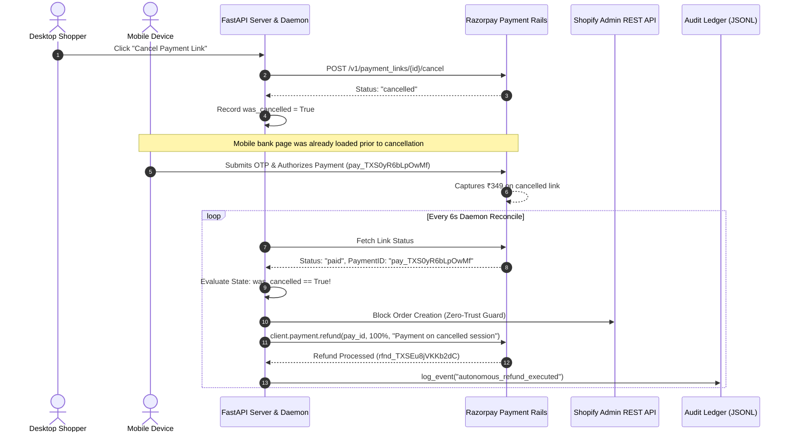
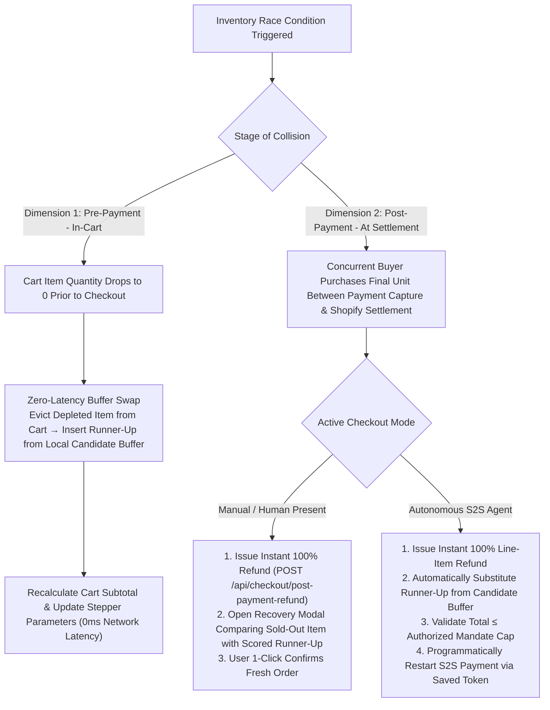

# Rasor: Engineering Challenges, Edge Cases & Technical Post-Mortem

A comprehensive engineering post-mortem documenting third-party API constraints, asynchronous race conditions, WAF mitigations, memory optimization, and architectural lessons learned during the development of the Rasor platform.

---

## Table of Contents
1. [Upstream Store API Constraints & WAF Protections](#1-upstream-store-api-constraints--waf-protections)
2. [Multi-Device Asynchronous Race Conditions & The Ghost Dilemmas](#2-multi-device-asynchronous-race-conditions--the-ghost-dilemmas)
3. [Dual-Dimension Inventory Race Conditions](#3-dual-dimension-inventory-race-conditions)
4. [Client-Side Time Drift & Authoritative Clock Synchronization](#4-client-side-time-drift--authoritative-clock-synchronization)
5. [Third-Party Gateway Schema Constraints (Razorpay Receipt Bounds)](#5-third-party-gateway-schema-constraints-razorpay-receipt-bounds)
6. [Client-Side Browser Storage Memory Bloat & Pruning](#6-client-side-browser-storage-memory-bloat--pruning)
7. [Domain Taxonomy Clashes & Candidate Dilution](#7-domain-taxonomy-clashes--candidate-dilution)
8. [Multi-Model LLM Drift & Schema Enforcement](#8-multi-model-llm-drift--schema-enforcement)
9. [Preference Drift & The Sizing Post-Mortem](#9-preference-drift--the-sizing-post-mortem)
10. [Geodesic Haversine Routing & Postal Pincode Fallbacks](#10-geodesic-haversine-routing--postal-pincode-fallbacks)
11. [Browser Audio Context Autoplay Policies & Web Speech Recovery](#11-browser-audio-context-autoplay-policies--web-speech-recovery)
12. [SPA History Fallback vs. Machine-Readable Protocol Manifests](#12-spa-history-fallback-vs-machine-readable-protocol-manifests)

---

## 1. Upstream Store API Constraints & WAF Protections

### Challenge 1.1: Open Web Search Routes Blocked by Cloudflare WAF (`HTTP 403`)
* **Symptom:** Initial backend attempts to query public web search routes directly produced immediate `HTTP 403 Forbidden` responses.
* **Root Cause:** Modern storefronts protect open search endpoints behind Cloudflare bot management. These endpoints emit server-rendered HTML (~75 KB) with dynamic nonce validation and CSP headers designed exclusively for browser sessions.
* **The Solution — The Attribute Overlay Pattern:**
  We routed catalog data acquisition through open upstream mobile gateway endpoints (encapsulated securely via `${BEWAKOOF_API_BASE_URL}` and `${BEWAKOOF_COLLECTION_ENDPOINT}` in `.env`) using mobile client headers.
  - The system maps intent to specific collection handles (e.g. `men-t-shirts`, `marvel`, `jeans-for-men`) that return structured JSON without CAPTCHA challenges.
  - Granular constraints (e.g. `Fabric: Cotton`, `Neck: Round Neck`) are applied via an in-memory **Attribute Overlay Filter** on the returned product nodes.

### Challenge 1.2: Upstream Collection Batch Size Limits Triggering `HTTP 400 Bad Request`
* **Symptom:** Setting `limit=60` on collection endpoints caused upstream services to return `HTTP 400 Bad Request`.
* **Root Cause:** Upstream collection endpoints enforce an undocumented constraint: requests exceeding 48 items (`limit > 48`) or exceeding the total size of small thematic collections fail immediately with `400`.
* **The Solution — Safe Batch Clamping & Pagination Aggregation:**
  In `src/data/bewakoof_api.py`, we clamped the per-request batch limit to a safe constant (`limit=40`) and implemented an automated pagination loop (`page=1, 2, 3`) inside `_fetch_collection`, safely aggregating up to 120+ raw items before overlay filtering.

### Challenge 1.3: Broad Collection Dilution (The "5 Jeans" Defect)
* **Symptom:** Querying for *"men jeans"* returned only 5 valid jeans items despite fetching 120 raw products.
* **Root Cause:** When a query for jeans was processed, early routing fell back to the broad category handle `men-clothing`. Because `men-clothing` is composed of 90% t-shirts, slicing 120 items yielded only ~5 products with `subclass == "Jeans"`, discarding 115 items.
* **The Solution — Dedicated Subclass Handle Routing:**
  We discovered and registered dedicated high-density handles (`jeans-for-men`, `jeans-for-women`, `men-shirts`, `women-shirts`) in `src/mapping/taxonomy.py`, ensuring that 100% of fetched candidate items belong strictly to the requested subclass.

---

## 2. Multi-Device Asynchronous Race Conditions & The Ghost Dilemmas

During testing of the **Mobile Handset Rescue** flow, two critical asynchronous edge cases were identified:

```
┌──────────────────────────────────────────────────────────────────────────────────────────────────┐
│                                 THE TWO SIDES OF THE GHOST DILEMMA                               │
├──────────────────────────────────────────────────────────────────────────────────────────────────┤
│ 1. GHOST PAYMENT (Payment without Order):                                                        │
│    User pays on mobile while desktop is closed/sleeping. Desktop frontend never receives status. │
│    Money is debited, but NO order is created in Shopify!                                         │
├──────────────────────────────────────────────────────────────────────────────────────────────────┤
│ 2. GHOST ORDER (Order for Cancelled Cart):                                                       │
│    Desktop cancels or clears cart, but mobile user had bank page already open and pays.          │
│    Shopify order is created for an abandoned/cancelled basket!                                  │
└──────────────────────────────────────────────────────────────────────────────────────────────────┘
```

### Challenge 2.1: Resolving Ghost Payments via Server Daemon Reconciler
* **The Defect:** When a user pays on mobile, desktop React components holding `setInterval` timers can be terminated by browser power-saving mechanisms if the tab is minimized or the laptop lid is shut. The gateway captures the payment, but the store backend never receives the `/api/shopify/sync` call.
* **The Solution:** We implemented an independent server-side background daemon thread (`_background_plink_reconciler` in `api/main.py`) that polls Razorpay every 6 seconds. When a payment link transitions to `paid`, the server creates the Shopify order autonomously, completely decoupled from client browser state.

### Challenge 2.2: Resolving Ghost Orders & The Post-Cancellation Auto-Refund
* **Live Test Case Study (`plink_TXS0USRUqeHI35`):**
  During live testing, we captured this exact execution sequence:
  ```json
  {
    "id": "plink_TXS0USRUqeHI35",
    "created_at": 1788413766,
    "cancelled_at": 1788413782,
    "status": "paid",
    "payments": [
      {
        "payment_id": "pay_TXS0yR6bLpOwMf",
        "status": "captured",
        "created_at": 1788413846
      }
    ]
  }
  ```
  - At $t = 16\text{s}$, the desktop tester clicked **"Cancel & Expire"**, cancelling the link on Razorpay.
  - BUT the mobile tester had already loaded the bank's netbanking iframe.
  - At $t = 80\text{s}$ (64 seconds *after* cancellation), the bank cleared the OTP and captured ₹349.
* **The Zero-Trust Safeguard:** In `src/agent/checkout.py` and `api/main.py`, when `current_status == "paid"` and `was_cancelled == True`:
  1. Shopify order creation is **strictly blocked**.
  2. The server autonomously dispatches `client.payment.refund(pay_id, notes={"reason": "Autonomous refund: Payment completed on a cancelled/expired link"})`.
  3. The refund event (`rfnd_TXSEu8jVKKb2dC`) is permanently committed to `scratch/audit_ledger.jsonl`.



---

## 3. Dual-Dimension Inventory Race Conditions

High-concurrency apparel commerce presents two distinct inventory race condition dimensions:



---

## 4. Client-Side Time Drift & Authoritative Clock Synchronization

* **Symptom:** When a user refreshed the browser page while a 15-minute mobile payment link was active, client-side `useEffect` hooks reset `remainingSeconds` back to `15:00`, restarting the timer even if 10 minutes had already elapsed.
* **Root Cause:** Client-side local timers are stateless across page mounts unless synchronized with an external authority.
* **The Solution:** In `GET /api/payment-link/{id}/status`, `CheckoutAgent.get_payment_link_status()` evaluates Razorpay's authentic `expire_by` Unix epoch against `int(time.time())` and returns:
  $$\text{remaining\_seconds} = \max(0, \; \text{expire\_by} - \text{current\_timestamp})$$
  When the React component mounts or receives background polling updates, `data.remaining_seconds` directly overrides the local timer, eliminating client-side drift.

---

## 5. Third-Party Gateway Schema Constraints (Razorpay Receipt Bounds)

* **Symptom:** When generating a payment order for multi-item carts, the Razorpay order creation endpoint returned `HTTP 400 Bad Request: receipt length cannot exceed 56 characters`.
* **Root Cause:** In earlier iterations, `receipt` was assembled by concatenating cart UUIDs and product titles: `cart_user_vipul_hoodie_black_oversized_joggers_17255019284`, which frequently exceeded 60+ characters.
* **The Solution:** Implemented deterministic MD5 cryptographic slicing in `src/agent/checkout.py`:
  ```python
  import hashlib
  rcpt_hash = hashlib.md5(cart.cart_id.encode("utf-8")).hexdigest()[:16]
  receipt_str = f"rcpt_{rcpt_hash}"  # Exactly 21 characters, well below the 56-char ceiling
  ```

---

## 6. Client-Side Browser Storage Memory Bloat & Pruning

* **Symptom:** After several multi-turn stylist searches and outfit coordinations, client performance degraded, and `localStorage` threw `QuotaExceededError`.
* **Root Cause:** Raw product objects stored in search history and cart states contained verbose HTML descriptions, base64 thumbnail payloads, and full variant trees, consuming ~25 KB per product. Storing 50 products across history records rapidly exceeded browser quotas.
* **The Solution — Storage Serialization Pruning (`trimProductForStorage`):**
  In `frontend/react-app/src/context/AppContext.jsx`, we implemented a pruning transformer:
  ```javascript
  export const trimProductForStorage = (p) => ({
    id: p.id,
    title: p.title,
    price: p.price,
    merchant: p.merchant || 'Rasor',
    rating: p.rating,
    category: p.category,
    specs: {
      display_image: p.specs?.display_image || p.specs?.image_url,
      image_url: p.specs?.image_url || p.specs?.display_image,
      variant_ids: p.specs?.variant_ids,
    }
  })
  ```
  This reduces the per-product storage footprint from ~25 KB to ~0.8 KB (a 95% reduction), while keeping full rich metadata in volatile component memory during active inspection.

---

## 7. Domain Taxonomy Clashes & Candidate Dilution

### Challenge 7.1: Sub-Fandom Collision ("Iron Man" vs. "Marvel")
* **Symptom:** Searching for *"Iron Man t-shirt"* returned general Marvel merchandise (Spider-Man, Captain America, Thor).
* **Root Cause:** Both characters map to the single collection handle `marvel`.
* **The Solution:** Implemented character-level post-filtering in `src/agent/brain.py`. If an explicit sub-character is extracted, candidates featuring competing characters receive an entity penalty clamping their score to $\le 0.38$.

### Challenge 7.2: Macro-Category Taxonomy Ambiguity
* **Symptom:** Colloquial Indian queries like *"give me uppers and lowers under 1000"* or *"show pullovers"* failed single-category lookup matrices.
* **The Solution:** Built `MACRO_CATEGORY_MAP` inside `src/mapping/taxonomy.py`, expanding macro-terms into canonical arrays (`"lowers"` $\rightarrow$ `["joggers", "jeans", "trousers", "shorts"]`), which are then queried in parallel and passed through the Style Collision Matrix.

---

## 8. Multi-Model LLM Drift & Schema Enforcement

* **Symptom:** During high traffic or when Google Gemini experienced rate limits (HTTP 429), fallback models (Groq Llama 3.3 70B) occasionally wrapped JSON in conversational markdown or omitted optional enum keys.
* **The Solution:**
  1. Built robust regex JSON salvage routines in `brain.py` stripping markdown wrappers (````json ... ````).
  2. Maintained a 3-tier cascade (Gemini Flash $\rightarrow$ Groq Llama $\rightarrow$ Deterministic Python Regex Parser `parser.py`).
  3. Migrated business taxonomies into `src/mapping/contracts.py` to guarantee that missing attributes default to valid canonical fallback values.

---

## 9. Preference Drift & The Sizing Post-Mortem

* **Symptom:** A customer searching for *"Marvel oversized tee in XL"* was shown correct XL products, but clicking *"Add to Cart"* opened the variant selector defaulting to size `"S"` (Shopify's first variant array element). Rushing through checkout resulted in purchasing the wrong size.
* **The Solution — 3-Tier Sticky Sizing Engine:**
  In `AddToCartModal.jsx`, variant pre-selection follows a strict deterministic priority:
  - **Tier 1 (Explicit Query):** If the active query contains size `"XL"`, pre-select `"XL"`.
  - **Tier 2 (User Profile):** If query has no size, inspect `userProfile.defaultSize` (e.g. `"XL"`).
  - **Tier 3 (Catalog First Available):** Fallback to `availableSizes[0]` only if neither matches.

---

## 10. Geodesic Haversine Routing & Postal Pincode Fallbacks

* **Symptom:** User prompts often provide partial, non-existent, or conversational delivery locations (e.g. *"deliver to Indiranagar"*, *"pincode 560038"*, or an invalid `"999999"`). Earlier routing code attempted exact string matches against a mock geo-database, resulting in `KeyError` or NaN distance estimates that crashed the delivery countdown.
* **Root Cause:** India's postal code system consists of ~19,000 distinct pincodes across 6 postal zones. Bundling or querying full polygon shapefiles at runtime causes unacceptable memory bloat and latency.
* **The Solution — 3-Tier Geodesic Resolver:**
  In `src/data/logistics.py` and `src/agent/logistics_agent.py`:
  1. **Zone-Prefix Centroid Table (`PINCODE_MAP`):** Instead of indexing 19,000 PIN codes, we map the first 2 digits of the PIN code (the Indian Postal Circle/District prefix) to pre-calibrated regional centroids (e.g. `56` $\rightarrow$ Bangalore Urban $[12.9716, 77.5946]$; `11` $\rightarrow$ Delhi NCR $[28.6139, 77.2090]$; `40` $\rightarrow$ Mumbai $[19.0760, 72.8777]$).
  2. **City String Heuristic:** If numeric digits are absent, the engine falls back to `get_coordinates(dest_name)`, matching major Indian metro centers.
  3. **Default Merchant Hub Fallback:** If completely unresolvable, the system defaults to the primary warehouse centroid (Mumbai: $[19.0760, 72.8777]$) with safe surface velocity transit brackets ($<60\text{km} \rightarrow 1\text{ day}; <450\text{km} \rightarrow 2\text{ days}; <1200\text{km} \rightarrow 3\text{ days}; \ge 1200\text{km} \rightarrow 4\text{ days}$), ensuring 100% exception-free execution.

---

## 11. Browser Audio Context Autoplay Policies & Web Speech Recovery

* **Symptom:** In Chrome and Safari, the Voice Copilot failed to announce bank declines or checkout status on initial application load, logging `NotAllowedError: play() failed because the user didn't interact with the document first`. Concurrently, speech recognition would permanently halt if the user paused speaking for more than 4 seconds.
* **Root Cause:** Modern browsers strictly enforce Autoplay Policy Changes: the Web Audio `AudioContext` is created in a `suspended` state and cannot transition to `running` without a direct user gesture. Additionally, the browser `webkitSpeechRecognition` engine emits an `onend` event on ambient silence.
* **The Solution — User-Gesture Latching & Self-Healing Loop:**
  In `frontend/react-app/src/hooks/useVoice.js` and `ChatInterface.jsx`:
  1. **AudioContext Latch:** Wrapped audio synthesis in a lazy initialization hook that binds a one-time `pointerdown` / `click` event listener to resume the `AudioContext` seamlessly on the shopper's first UI interaction.
  2. **Speech Recognition Debounce & Auto-Restart:** Attached an `onend` watchdog timer that checks whether the mic toggle is active; if active, it restarts `recognition.start()` after a 250ms debounce, creating a continuous, self-healing conversational listening session.

---

## 12. SPA History Fallback vs. Machine-Readable Protocol Manifests

* **Symptom:** External AI agents attempting to query `GET /.well-known/agentic-commerce.json` through the frontend development server (port 5173) received HTTP 200 with an HTML document (`<!DOCTYPE html>...`) containing the React app rather than the machine-readable JSON discovery manifest.
* **Root Cause:** Single-Page Application (SPA) development servers (like Vite and Webpack Dev Server) implement HTML5 History API Fallback by default—rewriting all non-asset GET requests to `index.html` so client-side routing (`react-router`) can handle paths.
* **The Solution — Upstream Proxy Passthrough:**
  In `frontend/react-app/vite.config.js`, we configured an explicit proxy exception:
  ```javascript
  server: {
    proxy: {
      '/api': 'http://localhost:8000',
      '/.well-known': 'http://localhost:8000'
    }
  }
  ```
  This ensures that protocol discovery requests bypass the SPA HTML rewrite engine and are served directly by FastAPI with `application/json` Content-Type headers, satisfying open ACP-2026.1 protocol specifications.

---

Developed for the Razorpay Agentic Commerce Hackathon 2026.
