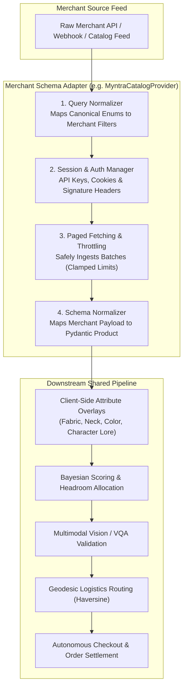

# Merchant Integration Guide: Scaling Beyond Bewakoof

This guide outlines the architectural blueprint and standardized protocols for onboarding new commerce merchants (e.g. Myntra, Amazon, Ajio, Flipkart) into Rasor's pluggable multi-catalog architecture.

---

## 1. The `BaseCatalogProvider` Interface Contract

Every merchant provider must inherit from [`src/data/base.py`](file:///Users/aai/Desktop/Rasor/src/data/base.py) and implement the standardized retrieval contract:

```python
class BaseCatalogProvider(ABC):
    @abstractmethod
    def search_products(
        self,
        query: str,
        category: Optional[str] = None,
        gender: Optional[str] = None,
        color: Optional[str] = None,
        size: Optional[str] = None,
        design: Optional[str] = None,
        fandom: Optional[str] = None,
        fit: Optional[str] = None,
        sleeve: Optional[str] = None,
        fabric: Optional[str] = None,
        neck: Optional[str] = None,
        max_price: Optional[float] = None,
        min_rating: Optional[float] = None,
        merchant: Optional[str] = None,
        limit: int = 6
    ) -> List[Product]:
        """Query merchant API/catalog and return normalized Pydantic Product models."""
        pass
```

---

## 2. Standardized Merchant Onboarding Pipeline



---

## 3. Product Normalization Mapping Specification

When normalizing a new merchant's JSON payload into Rasor's [`Product`](file:///Users/aai/Desktop/Rasor/src/state.py) model, map according to this specification:

| Rasor `Product` Field | Type | Description | Example Standard |
| :--- | :--- | :--- | :--- |
| `id` | `str` | Unique merchant product identifier | `"MYNTRA_12894012"` |
| `title` | `str` | Full clean product title | `"Men Solid Black Cotton Casual Shirt"` |
| `description` | `str` | Product summary / specification text | `"Slim fit 100% cotton casual shirt"` |
| `price` | `float` | Selling price (Numeric) | `799.0` |
| `currency` | `str` | ISO currency code | `"INR"` or `"USD"` |
| `merchant` | `str` | Merchant identifier | `"Myntra"` / `"Shopify"` / `"Bewakoof"` |
| `source_url` | `str` | Direct product deep link | `"https://..."` |
| `specs["image_url"]` | `str` | Primary high-resolution image URL | `"https://..."` |
| `specs["fabric"]` | `str` | Normalized fabric enum string | `"Cotton"` |
| `specs["neck"]` | `str` | Normalized neck style string | `"Polo"` |
| `specs["available_sizes"]` | `list` | Array of currently in-stock sizes | `["S", "M", "L", "XL"]` |
| `specs["rating"]` | `float` | Average customer review rating | `4.3` |
| `specs["review_count"]` | `int` | Total verified customer reviews | `142` |
| `specs["origin_pincode"]`| `str` | Factory fulfillment postal code | `"560001"` |

---

## 4. Registering New Merchants in Config & UI

1. Add the merchant to `DataSourceType` in [`src/config.py`](file:///Users/aai/Desktop/Rasor/src/config.py):
   ```python
   class DataSourceType(str, Enum):
       DEV_MOCK = "dev_mock"
       BEWAKOOF_LIVE_API = "bewakoof_live_api"
       SHOPIFY_STOREFRONT = "shopify_storefront"
       MYNTRA_LIVE_API = "myntra_live_api"
       GOOGLE_SHOPPING_SCRAPER = "google_shopping_scraper"
   ```
2. Instantiate the provider in [`api/main.py`](file:///Users/aai/Desktop/Rasor/api/main.py) and [`frontend/app.py`](file:///Users/aai/Desktop/Rasor/frontend/app.py).
3. The Intent Normalizer (`brain.py`), Bayesian rating scoring, Multimodal VQA inspection, Geodesic Logistics agent, and Headless Checkout engines will function out-of-the-box for the newly registered merchant.
