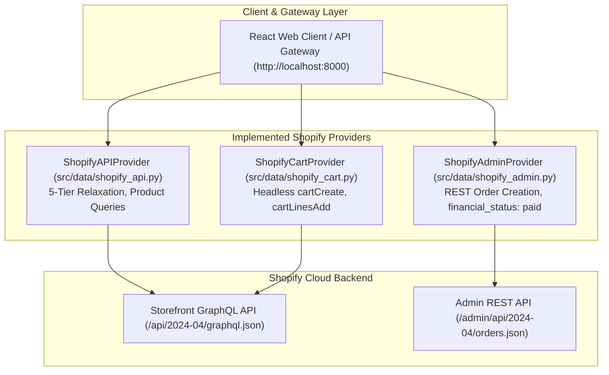

# Shopify Headless Commerce Integration Reference

[](shopify_storefront_api_reference.md)
[](API_SPECIFICATION.md)
[](http://localhost:8000/docs)
[](http://localhost:8000/scalar)

This document outlines how Shopify was investigated and integrated as the primary headless commerce settlement backend for the Rasor Agent, resolving the closed-loop checkout roadblocks encountered with legacy merchants.

> [!TIP]
> **Related Reference Specifications:**
> * For the exhaustive GraphQL schema, access scopes, and mutation signatures, see the [**Shopify Storefront API Reference (2024-04)**](shopify_storefront_api_reference.md).
> * For the orchestrating FastAPI Gateway REST endpoints and AP2 mandate schemas, see the [**Rasor API Specification & Protocols**](API_SPECIFICATION.md).
> * For live interactive testing of all gateway routes, run `./start.sh` and open [`http://localhost:8000/docs`](http://localhost:8000/docs) or the modern Scalar explorer at [`http://localhost:8000/scalar`](http://localhost:8000/scalar).

---

## 1. Architectural Purpose

Unlike traditional retailers that obscure their backend APIs and mandate human session logins for checkout (such as Bewakoof), Shopify natively supports **Headless Commerce**. Through the **Storefront GraphQL API** and **Admin REST API**, the autonomous agent executes the entire commerce lifecycle programmatically.

### Capabilities Implemented via Shopify APIs

1. **Autonomous Product Retrieval:** Executes GraphQL product queries with 5-tier progressive relaxation across tags, titles, product types, and available inventory.
2. **Headless Cart Initialization (`cartCreate`):** Autonomously spins up isolated carts without requiring cookies or active browser sessions.
3. **Line-Item Mutations (`cartLinesAdd`):** Dynamically injects variant GIDs and quantities based on user intent or automated bundle offers.
4. **Interactive Checkout Handoff:** Extracts hosted `checkoutUrl` endpoints for instant 1-click human payment.
5. **Backend Payment Settlement (`ShopifyAdminProvider`):** Pushes confirmed transactions from Razorpay into Shopify Admin REST (`/admin/api/2024-04/orders.json`), marking orders as `financial_status: "paid"` and attaching external transaction IDs.

---

## 2. API Endpoint Architecture (GraphQL)

Shopify's Storefront API utilizes a single unified GraphQL endpoint:
`POST https://{shop-name}.myshopify.com/api/2024-04/graphql.json`

Detailed query schemas, directives, and token scopes are cataloged in the [Shopify Storefront API Reference](shopify_storefront_api_reference.md).

### Production Cart Creation Mutation
```graphql
mutation CartCreate($input: CartInput!) {
  cartCreate(input: $input) {
    cart {
      id
      checkoutUrl
      lines(first: 10) {
        edges {
          node {
            id
            quantity
            merchandise {
              ... on ProductVariant {
                id
                title
                price {
                  amount
                  currencyCode
                }
              }
            }
          }
        }
      }
    }
    userErrors {
      field
      message
    }
  }
}
```

---

## 3. Implemented Components & Gateway Alignment

The investigation culminated in three production data providers within the codebase, exposed via the [FastAPI Gateway (`api/main.py`)](API_SPECIFICATION.md):



1. [`src/data/shopify_api.py`](file:///Users/aai/Desktop/Rasor/src/data/shopify_api.py):
   - Implements the 5-tier search relaxation algorithm.
   - Applies client-side attribute filtering (color, size, fit, and max price) over retrieved nodes.
   - Hydrates customer review ratings from local persistent cache.
   - Powers Gateway endpoints: `POST /api/search` and `POST /api/products/by-ids` (see [API Specification §2.B](API_SPECIFICATION.md#b-search-catalog--discovery)).
2. [`src/data/shopify_cart.py`](file:///Users/aai/Desktop/Rasor/src/data/shopify_cart.py):
   - Handles headless cart creation and merchandise line-item additions.
   - Extracts and normalizes checkout URLs for seamless UI handoff.
   - Powers Gateway endpoints: `POST /api/cart/create` and `POST /api/cart/add` (see [API Specification §2.F](API_SPECIFICATION.md#f-headless-cart--storefront-mutation)).
3. [`src/data/shopify_admin.py`](file:///Users/aai/Desktop/Rasor/src/data/shopify_admin.py):
   - Connects to the Shopify Admin REST API to synchronize externally captured Razorpay transactions.
   - Creates confirmed store orders with full line items, customer details, and payment transaction metadata.
   - Powers Gateway endpoints: `POST /api/shopify/sync` and `GET /api/shopify/orders` (see [API Specification §2.I](API_SPECIFICATION.md#i-settlement-background-reconciler--audit-ledger)).

---

## 4. Cross-Reference Index

| Resource | Scope | Link |
| :--- | :--- | :--- |
| **Storefront GraphQL Reference** | Complete Storefront GraphQL schema (2024-04), scopes, queries & mutations | [shopify_storefront_api_reference.md](shopify_storefront_api_reference.md) |
| **Gateway REST & Protocols** | 35 FastAPI routes, AP2 mandate contracts & ACP catalog feed | [API_SPECIFICATION.md](API_SPECIFICATION.md) |
| **Interactive OpenAPI Explorer** | Live interactive testing interface for all gateway endpoints | [http://localhost:8000/docs](http://localhost:8000/docs) |

---

Developed for the Razorpay Agentic Commerce Hackathon 2026.
