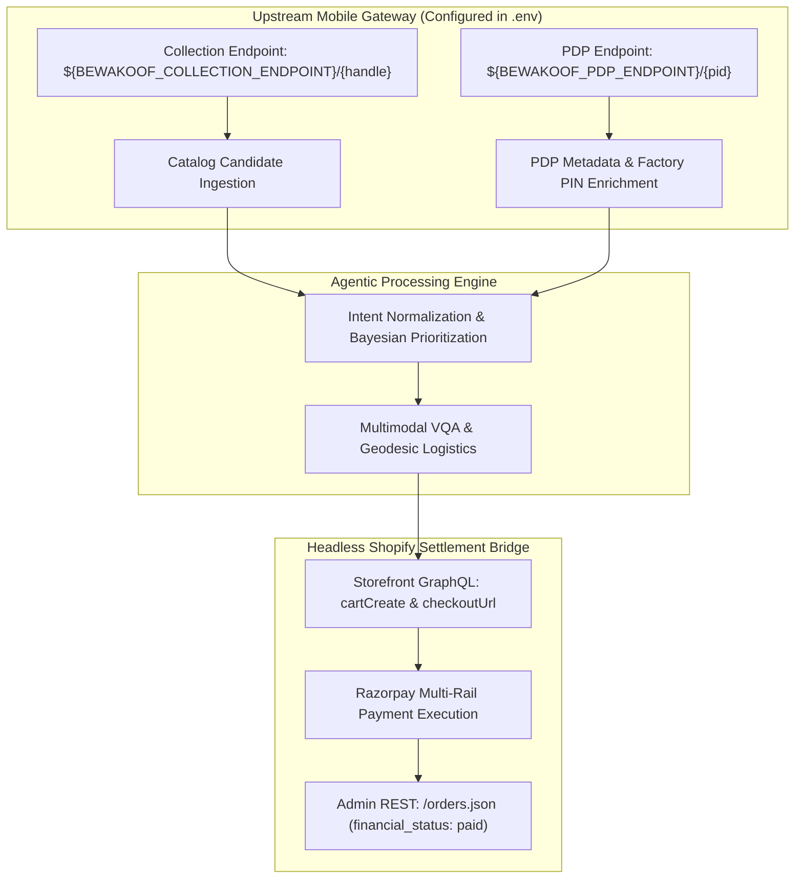

# Upstream Merchant API Access & Capability Matrix

> [!NOTE]
> **Academic & Educational Disclaimer:** This matrix documents findings from non-commercial academic research and benchmarking conducted for the Razorpay Agentic Commerce Hackathon 2026. All upstream merchant gateway URLs, access tokens, and route paths are strictly encapsulated within environment variables (`.env`) to avoid exposing internal infrastructure.

---

## 1. Upstream Discovery & Enrichment Endpoints

To enable zero-token catalog exploration and granular PDP enrichment without web scraping WAF blocks, the backend interfaces with upstream mobile gateway endpoints configured securely in the application environment:

### A. Upstream Collection Gateway (Catalog Retrieval & Filtering)
* **Configuration:** `${BEWAKOOF_API_BASE_URL}${BEWAKOOF_COLLECTION_ENDPOINT}/{handle}`
* **Environment Variables:** `BEWAKOOF_API_BASE_URL`, `BEWAKOOF_COLLECTION_ENDPOINT` (in `.env`)
* **Status:** Verified Active via authenticated mobile client headers.
* **Payload Structure:** Returns collection metadata, pricing, stock availability, size variants, primary image CDN URLs, and basic attributes (color, subclass). Clamped to 24–48 items per request to avoid upstream collection-size mismatch errors.
* **Platform Role:** Powers live catalog retrieval in `src/data/bewakoof_api.py`.

### B. Deep Product Details Gateway (PDP Enrichment)
* **Configuration:** `${BEWAKOOF_API_BASE_URL}${BEWAKOOF_PDP_ENDPOINT}/{product_id}`
* **Environment Variables:** `BEWAKOOF_API_BASE_URL`, `BEWAKOOF_PDP_ENDPOINT` (in `.env`)
* **Status:** Verified Active via authenticated mobile client headers.
* **Payload Structure:** 
  * `description`: Manufacturer product specifications and care instructions.
  * `specifications` & `properties`: Granular material composition (e.g. 100% combed cotton, single jersey knit), fit details, and wash care.
  * `variant`: Exact weights, dimensions, and SKU codes per size.
  * `media`: High-resolution gallery image array.
  * `tags` & `offer_tags`: Active promotional discounts.
  * `origin_pincode` / `manufactured_by`: Factory fulfillment location used by Haversine logistics routing.
* **Platform Role:** Concurrent multi-threaded enrichment (`enrich_product`) in `src/data/bewakoof_api.py`, feeding LLM candidate reasoning, multi-product comparison, and logistics transit calculations.

---

## 2. Proprietary Boundaries & Headless Settlement Architecture

During empirical network analysis, boundaries between open discovery routes and closed-loop transactional systems were identified:

### A. Customer Textual Reviews
* **Scope:** Upstream review endpoints.
* **Status:** Third-party iframe delegated.
* **Observation:** Verified average rating ($R$) and review count ($C$) are accessible in main product payloads, but raw customer review texts are offloaded to third-party providers requiring customer-facing iframe tokens.
* **Mitigation:** Numerical ratings and review volumes are ingested and normalized via the Bayesian Popularity formula in `src/agent/brain.py`.

### B. Closed-Loop Cart & Checkout Services
* **Scope:** Upstream cart and checkout microservices.
* **Status:** Session-Locked / Anti-Bot Protected.
* **Observation:** Merchant checkout endpoints reside behind closed proprietary microservices requiring authenticated user-session cookies and anti-bot headers. External AI agents cannot programmatically create orders or settle transactions directly against merchant servers.
* **Architectural Solution:** Led directly to the **Headless Shopify Bridge** (`shopify_import.csv`). Catalog structures are mirrored to a dedicated Shopify headless instance, granting the agent programmatic cart mutations (`cartCreate`, `cartLinesAdd`) via Storefront GraphQL and automated order settlement via Shopify Admin REST (`financial_status: "paid"`).

---

## 3. Production Architecture Mapping

